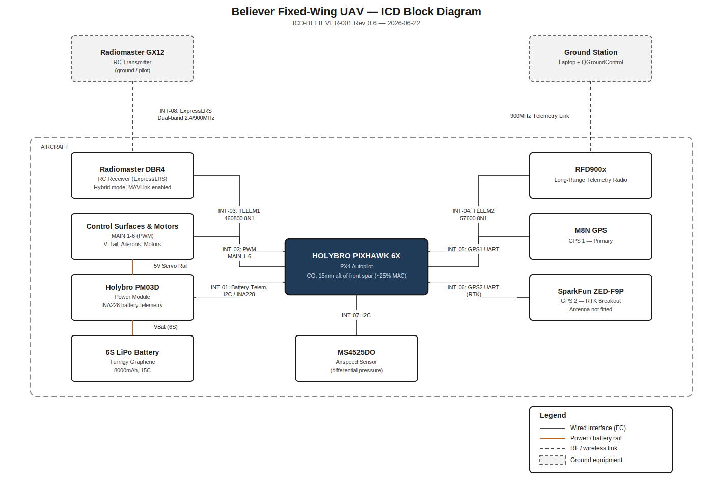
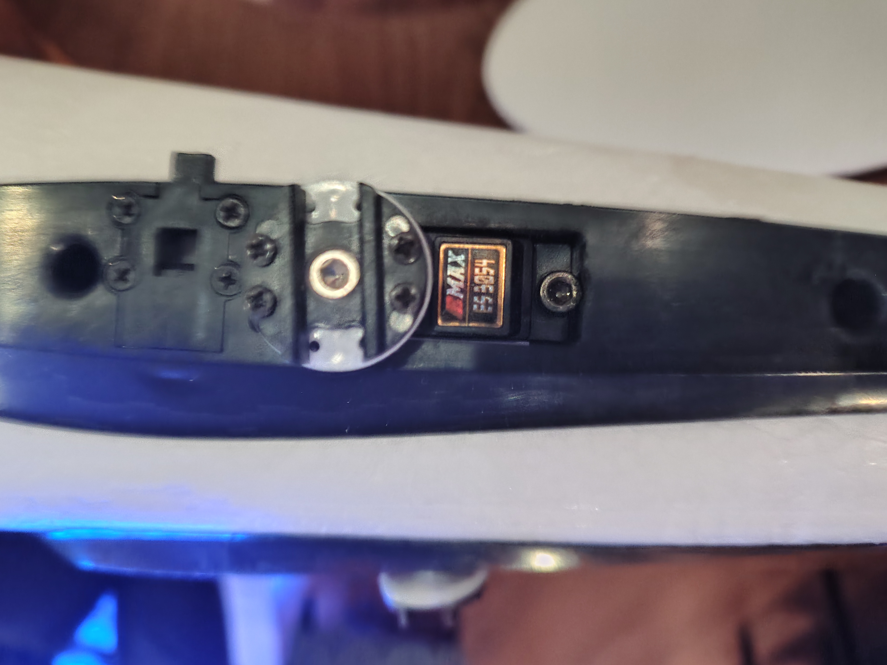
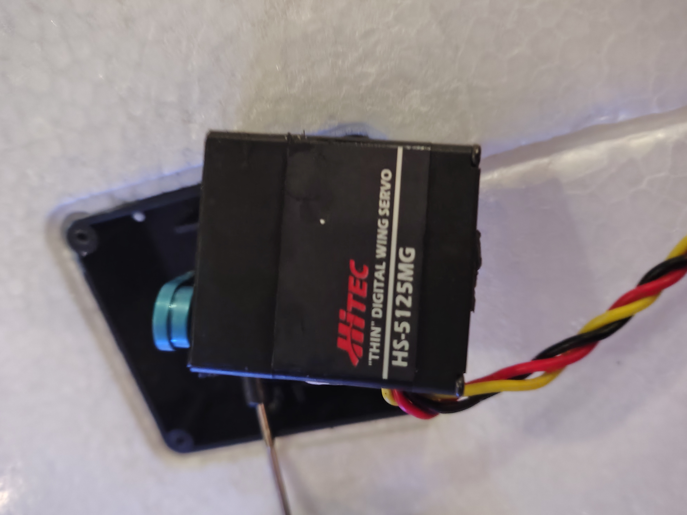
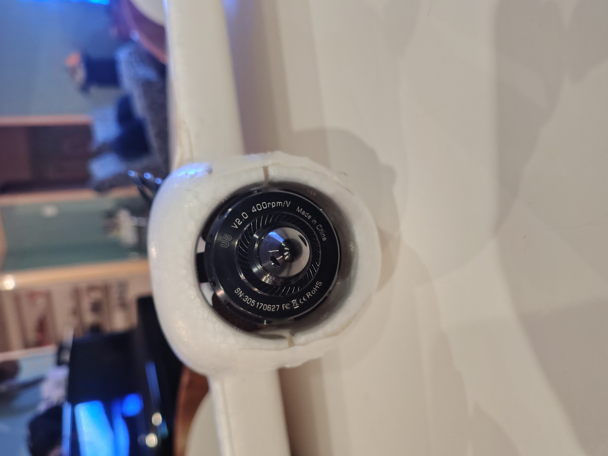
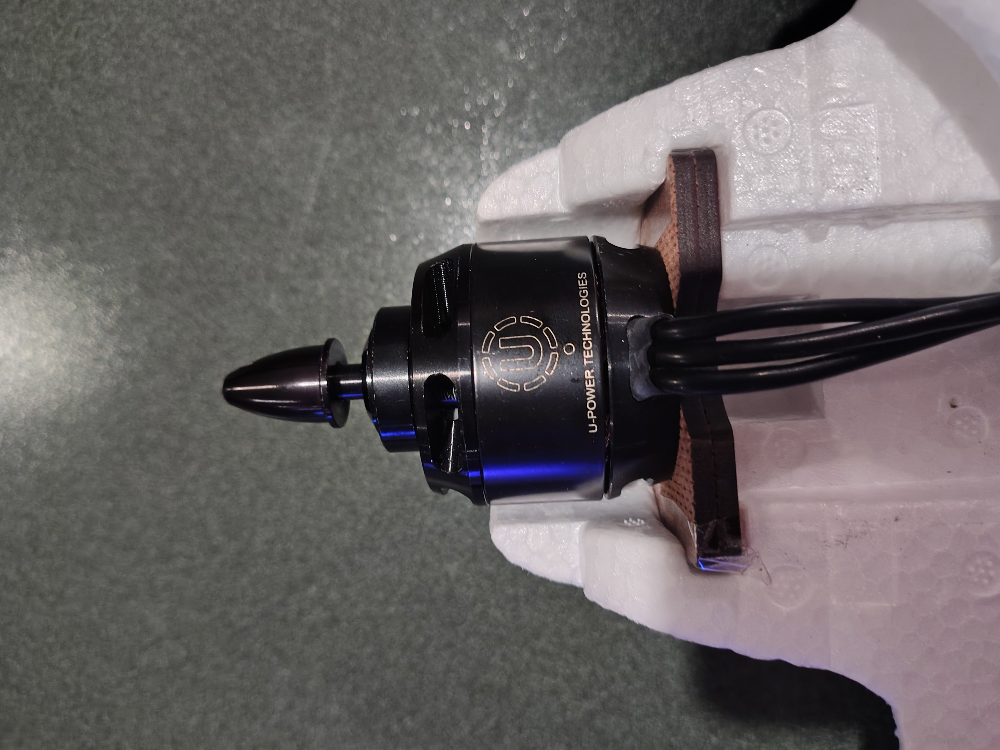
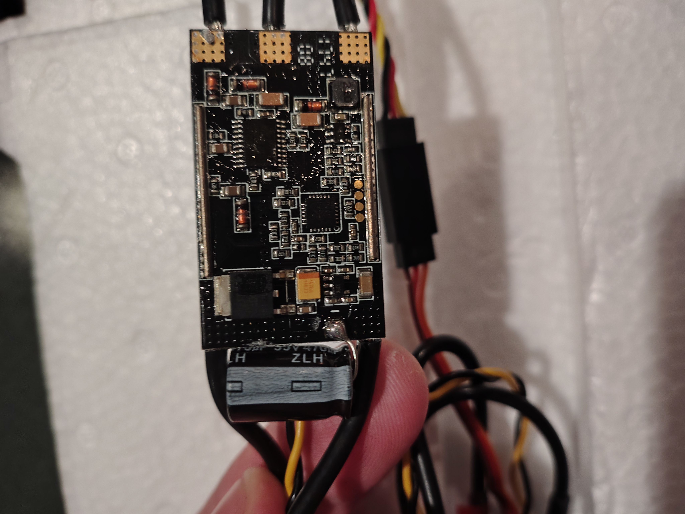

# Believer Fixed-Wing UAV - Interface Control Document

| | |
|---|---|
| **Document** | ICD-BELIEVER-001 |
| **Revision** | 1.2 |
| **Date** | 2026-07-05 |
| **Status** | Draft |

## 1. Scope

This document defines the physical, electrical, and data interfaces between the avionics subsystems of the Believer fixed-wing UAV: the flight controller (FC), power module, control surface and motor actuators, telemetry and RC radio links, GPS receivers, and the airspeed sensor.

## 2. Reference Documents

- Believer Project Proposal (QUTAS, 2026-01-25) - `docs/reference/`
- QUTAS EER Funding Application (2026-05-20) - `docs/reference/`
- Purchase invoices - `docs/purchase-history/invoices/`
- PX4 parameter change history - `params/parameter-change-log.md`
- Component datasheets - `Component datasheets/`

## 3. System Description

The Believer is a V-tail, twin-motor fixed-wing airframe. The flight controller is a Holybro Pixhawk 6X running PX4. Centre of gravity is located 15mm aft of the front wing spar carbon rod centreline, approximately 25% of the mean aerodynamic chord (MAC).

The servo rail is electrically isolated from the main flight controller power supply and is fed independently at 5V from the power module.

## 4. System Block Diagram

## 5. Interface Summary

| ID | Interface | Type | Endpoint A | Endpoint B |
|---|---|---|---|---|
| INT-01 | Power distribution | Power | Holybro PM03D power module | FC, servo rail (5V) |
| INT-02a | V-Tail Left servo (MAIN 1) | PWM | FC MAIN 1 | Emax ES3054 |
| INT-02b | V-Tail Right servo (MAIN 2) | PWM | FC MAIN 2 | Emax ES3054 |
| INT-02c | Left Aileron servo (MAIN 3) | PWM | FC MAIN 3 | Hitec HS-5125MG |
| INT-02d | Left Motor (MAIN 4) | PWM | FC MAIN 4 | T-Motor U5 v2.0 (via ESC) |
| INT-02e | Right Aileron servo (MAIN 5) | PWM | FC MAIN 5 | Hitec HS-5125MG |
| INT-02f | Right Motor (MAIN 6) | PWM | FC MAIN 6 | T-Motor U5 v2.0 (via ESC) |
| INT-03 | RC control link | Serial, TELEM1 | FC | Radiomaster DBR4 receiver |
| INT-04 | Telemetry link | Serial, TELEM2 | FC | RFD900x radio modem |
| INT-05 | GPS 1 (primary) | Serial, GPS1 UART | FC | M8N GPS module |
| INT-06 | GPS 2 (RTK) | Serial, GPS2 UART | FC | SparkFun GPS-RTK-SMA Breakout (ZED-F9P) |
| INT-07 | Airspeed sensor | I2C | FC | MS4525DO differential pressure sensor |
| INT-08 | RC transmitter link | RF, ExpressLRS dual-band (2.4GHz/900MHz) | Radiomaster GX12 transmitter | Radiomaster DBR4 receiver |

Open items against this interface set are tracked in [context/open-items.md](../context/open-items.md).

## 6. Interface Definitions

### INT-01 - Power Distribution

Power module: Holybro PM03D.

| Characteristic | Value |
|---|---|
| Battery telemetry | INA228 voltage/current monitor (`SENS_EN_INA228` enabled) |
| Battery | 6S LiPo (`BAT1_N_CELLS` = 6S) |
| Servo rail | 5V, electrically isolated from main FC supply |

### INT-02a through INT-02f - Actuator Outputs (PWM MAIN 1-6)

All flight control surface and motor servos connect to the FC's PWM outputs.

| Control Input | PWM Output | Min (µs) | Max (µs) | Disarmed (µs) | Trim (µs) | Reversed |
|---|---|---|---|---|---|---|
| V-Tail Left | MAIN 1 | 1100 | 1900 | 1500 | 1500 | Yes |
| V-Tail Right | MAIN 2 | 1100 | 1900 | 1500 | 1500 | No |
| Left Aileron | MAIN 3 | 1100 | 1900 | 1500 | 1500 | Yes |
| Left Motor | MAIN 4 | 1000 | 2000 | 1000 | 1000 | No |
| Right Aileron | MAIN 5 | 1100 | 1900 | 1500 | 1500 | No |
| Right Motor | MAIN 6 | 1000 | 2000 | 1000 | 1000 | No |

#### Connected Devices

| PWM Output | Function | Device |
|---|---|---|
| MAIN 1 | V-Tail Left | Emax ES3054 (V-tail servo) |
| MAIN 2 | V-Tail Right | Emax ES3054 (V-tail servo) |
| MAIN 3 | Left Aileron | Hitec HS-5125MG (wing servo) |
| MAIN 4 | Left Motor | T-Motor U5 v2.0 (via ESC) |
| MAIN 5 | Right Aileron | Hitec HS-5125MG (wing servo) |
| MAIN 6 | Right Motor | T-Motor U5 v2.0 (via ESC) |

**V-Tail Servos (MAIN 1, MAIN 2) - Emax ES3054**

| Characteristic | Value |
|---|---|
| Type | Digital, metal gear |
| Weight | 17g |
| Dimensions | 28.45 x 13.00 x 31.10mm |
| Operating voltage | 4.8 - 6.0V |
| Torque @ 4.8V / 6.0V | 3.0 / 3.5 kg.cm |
| Speed @ 4.8V / 6.0V | 0.15 / 0.13 sec/60° |
| Spline | 23T |

**Aileron Servos (MAIN 3, MAIN 5) - Hitec HS-5125MG**

| Characteristic | Value |
|---|---|
| Type | Digital, metal gear, slim wing |
| Weight | 24g |
| Dimensions | 30 x 10 x 34mm |
| Operating voltage | 4.8 - 6.0V |
| Torque @ 4.8V / 6.0V | 3.0 / 3.5 kg.cm |
| Speed @ 4.8V / 6.0V | 0.17 / 0.13 sec/60° |
| Spline | Micro 25T |

**Motors (MAIN 4, MAIN 6) - T-Motor U5 v2.0**

| Characteristic | Value |
|---|---|
| KV | 400 |
| Configuration | 12N14P |
| Weight | 156g (excl. cables) |
| Dimensions | Φ42.5 x 37.5mm |
| Shaft diameter | 5mm |
| Voltage range | 3-8S LiPo |
| Max continuous current (180s) | 30A |
| Max continuous power (180s) | 850W |
| Internal resistance | 116mΩ |
| ESC | T-Motor (model TBD - see open items) |
| Propeller | 11x7" (Hobbyrama LP11X7E) |
| Propeller rotation | Outward contra-rotating; both propellers currently fitted are the same handedness - reverse-pitch prop TBD, see open items |

### INT-03 - RC Control Link (TELEM1)

Radiomaster DBR4 dual-band (2.4GHz/900MHz) ExpressLRS receiver, connected to FC TELEM1. Operating mode: ELRS Hybrid switch mode with MAVLink enabled. Paired transmitter: Radiomaster GX12 (INT-08).

| Parameter | Value |
|---|---|
| `RC_PORT_CONFIG` | TELEM 1 |
| `SER_TEL1_BAUD` | 460800 8N1 |
| `RC_MAP_ARM_SW` | Channel 5 |
| `RC_MAP_KILL_SW` | Channel 7 |
| `MAV_1_CONFIG` | TELEM 1 |
| `MAV_1_MODE` | OSD |
| `MAV_1_RATE` | 19200 B/s |

ELRS Hybrid mode carries RC channels through CH12 only (CH13–16 are not transmitted).

A MAVLink telemetry stream (instance MAV_1, device `/dev/ttyS6`) is tunnelled over this same link alongside RC control. `BATTERY_STATUS` is forced to 10Hz via a `mavlink stream` command in `/fs/microsd/etc/extras.txt`, overriding the OSD mode's 0.5Hz default.

#### RC Channel Map

| Channel | Function | Notes |
|---|---|---|
| CH1 | Roll | Stick |
| CH2 | Pitch | Stick |
| CH3 | Throttle | Stick |
| CH4 | Yaw | Stick |
| CH5 | Arm | Latching; disarmed at startup |
| CH6 | Flight-mode selector (GR1) | Six-position switch group, defaults to SW2 |
| CH7 | Emergency kill | Inverted in EdgeTX |
| CH8 | Loiter / Hold | Latching; overrides the GR1-selected mode |
| CH9 | Flaperon control | Inverted in EdgeTX; disabled for maiden flight |
| CH10 | Return | Inverted in EdgeTX |
| CH11 | Offboard | Inverted in EdgeTX |
| CH12 | Spare / future buzzer or payload | Mixed from SH switch in EdgeTX; no PX4 function currently assigned |

#### GX12 Physical Switch Locations

#### Flight-Mode Mapping (GR1)

| Switch Position | PX4 Mode |
|---|---|
| SW1 | Manual |
| SW2 | Stabilized |
| SW3 | Altitude |
| SW4 | Position |
| SW5 | Mission |
| SW6 | Hold |

### INT-04 - Telemetry Link (TELEM2)

RFD900x long-range telemetry radio modem, connected to FC TELEM2 per the RFD900 datasheet.

| Wire Colour | RFD900 Pin | FC Pin |
|---|---|---|
| Black | GND | GND |
| Brown | Vcc | 5V |
| Yellow | Rx | TX1 |
| Red | Tx | RX1 |

| Parameter | Value |
|---|---|
| `MAV_0_CONFIG` | TELEM 2 |
| `MAV_0_MODE` | Normal |
| `SER_TEL2_BAUD` | 57600 8N1 |
| `MAV_0_RATE` | 3000 B/s |
| `MAV_0_FLOW_CTRL` | Disabled |

Device `/dev/ttyS4`. `BATTERY_STATUS` is forced to 5Hz via a `mavlink stream` command in `/fs/microsd/etc/extras.txt`, overriding the Normal mode default.

#### RFD900x Connector Pinout (full 16-pin)

| Pin | Signal | Direction | Function | Level |
|---|---|---|---|---|
| 1 | GND | - | Ground | 0V |
| 2 | GND | - | Ground | 0V |
| 3 | CTS | Input | Clear to send | 3.3V |
| 4 | Vcc | - | Power supply | 5V |
| 5 | Vusb | - | Power supply from USB | 5V |
| 6 | Vusb | - | Power supply from USB | 5V |
| 7 | RX | Input | UART Data In | 3.3V |
| 8 | GPIO5/P3.4 | I/O | Digital I/O | 3.3V |
| 9 | TX | Output | UART Data Out | 3.3V |
| 10 | GPIO4/P3.3 | I/O | Digital I/O | 3.3V |
| 11 | RTS | Output | Request to send | 3.3V |
| 12 | GPIO3/P1.3 | I/O | Digital I/O | 3.3V |
| 13 | GPIO0/P1.0 | I/O | Digital I/O | 3.3V |
| 14 | GPIO2/P1.2 | I/O | Digital I/O | 3.3V |
| 15 | GPIO1/P1.1 | I/O | Digital I/O, PPM I/O | 3.3V |
| 16 | GND | - | Ground | 0V |

### INT-05 - GPS 1 (Primary)

M8N GPS module (u-blox protocol), connected to FC GPS1 UART.

| Parameter | Value |
|---|---|
| `GPS_1_CONFIG` | GPS 1 |
| `GPS_1_PROTOCOL` | u-blox |
| `GPS_1_GNSS` | 21 |
| `GPS_UBX_DYNMODEL` | Airborne <4g |

### INT-06 - GPS 2 / RTK

SparkFun GPS-RTK-SMA Breakout (u-blox ZED-F9P), connected to FC GPS2 UART.

| Parameter | Value |
|---|---|
| `GPS_2_GNSS` | 29 |

Antenna not yet fitted - tracked as a maiden flight blocker in [build-checklist.md](build-checklist.md).

### INT-07 - Airspeed Sensor (I2C)

MS4525DO differential pressure sensor, connected to the Pixhawk 6X I2C port (JST-GH 4-pin).

| Characteristic | Value |
|---|---|
| Port | Pixhawk 6X I2C (JST-GH 4-pin: VCC, SCL, SDA, GND) |
| I2C address | 0x28 (default) |

| Parameter | Value |
|---|---|
| `SENS_EN_MS4525DO` | 1 (Enabled) |
| `SENS_EXT_I2C_PRB` | 1 (Enabled) |

### INT-08 - RC Transmitter Link

Radiomaster GX12 Crush ExpressLRS transmitter (Iron Grey) - Gemini-X dual-band, 2.4GHz and 900MHz simultaneous. Pairs with the Radiomaster DBR4 receiver (INT-03) in ELRS Hybrid switch mode with MAVLink enabled. Physical switch locations and functions are shown in INT-03.

Packet rate: 100Hz Full.

## 7. Open Items

Tracked in [context/open-items.md](../context/open-items.md).

## 8. Revision History

| Rev | Date | Description |
|---|---|---|
| 0.1 | 2026-06-21 | Initial issue |
| 0.2 | 2026-06-21 | Added power, GPS, and telemetry interface detail |
| 0.3 | 2026-06-21 | Added RC channel map and flight-mode mapping |
| 0.4 | 2026-06-21 | Confirmed power module and GPS routing; rewritten for clarity |
| 0.5 | 2026-06-21 | Added system block diagram |
| 0.6 | 2026-06-22 | Redrawn block diagram with orthogonal routing, uniform box sizing, and a white background |
| 0.7 | 2026-06-22 | Confirmed CH12 (SH switch) routing against the GX12 EdgeTX radio backup and the QGC Flight Modes Config screenshot; added screenshot |
| 0.8 | 2026-06-22 | Corrected INT-08: transmitter is the GX12 **Crush** (Iron Grey), not the standard GX12. Added annotated front/top switch-location diagrams |
| 0.9 | 2026-07-02 | Added INT-02 connected device specs: V-tail servos (Emax ES3054), aileron servos (Hitec HS-5125MG), motors (T-Motor U5 v2.0 KV400). ESC identified as T-Motor branded, model TBD |
| 1.0 | 2026-07-03 | Split INT-02 into INT-02a-f (one interface per PWM output); added full 16-pin RFD900x connector pinout table under INT-04; updated block diagram to show individual actuator connections |
| 1.1 | 2026-07-03 | Added INT-07 I2C port and address detail |
| 1.2 | 2026-07-05 | Added INT-08 ELRS packet rate; added MAV_1 (TELEM1/DBR4) and MAV_0 (TELEM2/RFD900x) MAVLink instance parameters, device paths, and BATTERY_STATUS rate overrides |
