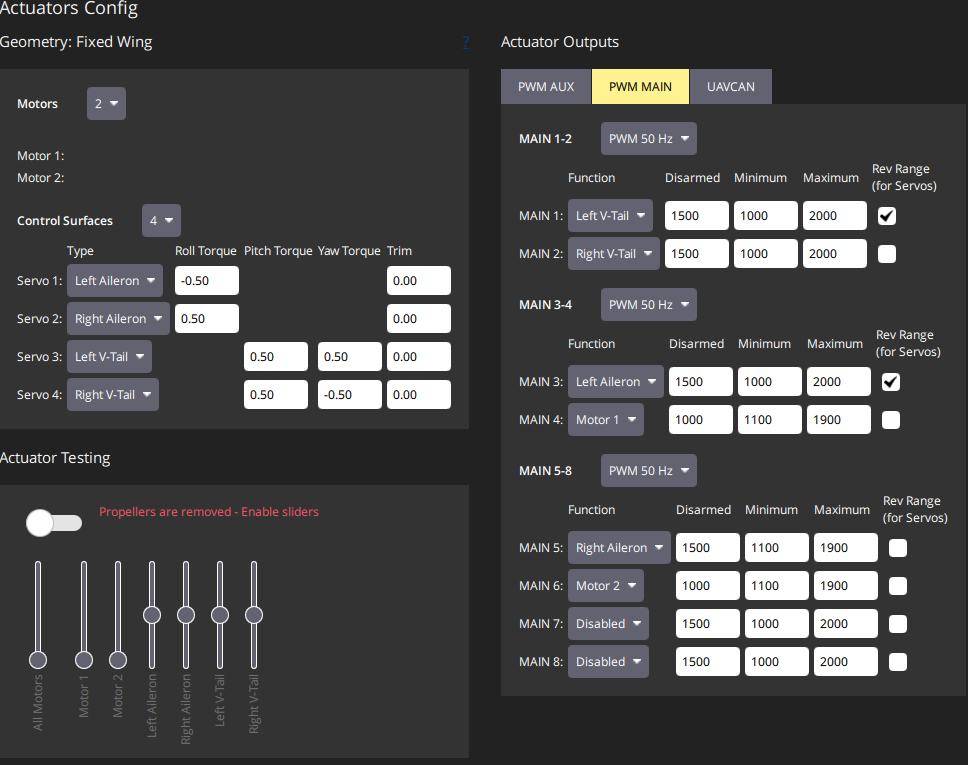
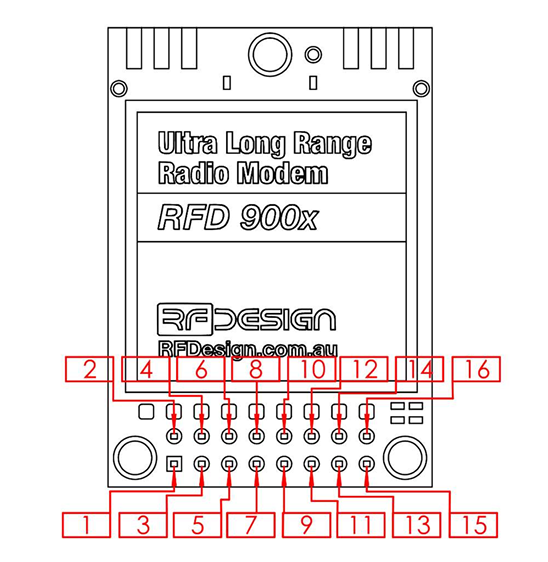

# Believer Fixed-Wing UAV — Interface Control Document (ICD)

| | |
|---|---|
| **Project** | Believer Fixed-Wing UAV |
| **Status** | Draft — most interfaces confirmed, see Open Items |
| **Source** | Believer Checklist.docx, QGroundControl actuator config, believer_PX4_Parameter_Change_Log.xlsx, Shopping List 27_02_26.xlsx |

## 1. Purpose & Scope

This document defines the physical, electrical, and data interfaces between the avionics subsystems on the Believer airframe: flight controller (FC), power distribution board (PDB), control surface/motor actuators, telemetry/RC radios, GPS receivers, and the airspeed sensor.

## 2. System Overview

- Airframe: V-tail, twin-motor (left/right) fixed wing.
- Flight controller: Pixhawk-series, running **PX4** (confirmed via QGroundControl Actuators Config UI).
- Centre of Gravity: 15mm aft of the front wing spar carbon rod centerline (~25% MAC).
- Servo rail is electrically isolated from FC power and is fed independently 5V from the PDB.

## 3. Interface Summary

| ID | Interface | Type | Endpoint A | Endpoint B | Status |
|---|---|---|---|---|---|
| INT-01 | Power distribution | Power | Holybro PM03D | FC, servo rail (5V), battery telemetry | Confirmed |
| INT-02 | Actuator outputs | PWM | FC (MAIN 1-6) | Control surface servos, motors | Confirmed |
| INT-03 | RC link | Serial (Telem_1, 460800 8N1) | FC | Radiomaster DBR4 | Confirmed |
| INT-04 | Telemetry link | Serial (Telem_2, 57600 8N1) | FC | RFD900(x) | Confirmed |
| INT-05 | GPS 1 (primary) | Serial (GPS 1 UART, u-blox protocol) | FC | M8N GPS | Confirmed |
| INT-06 | GPS 2 (RTK) | Serial (GPS 2 UART) | FC | SparkFun ZED-F9P breakout | Partial — antenna not fitted |
| INT-07 | Airspeed sensor | I2C | FC | MS4525DO | Partial |
| INT-08 | RC transmitter | RF (ExpressLRS, dual-band 2.4/900MHz) | Radiomaster GX12 | Radiomaster DBR4 | Confirmed |

## 4. Detailed Interfaces

### INT-01: Power Distribution

Power module: **Holybro PM03D** (purchased 2026-05-11 with Julian's personal funds, not club funds — see [purchase-history.md](purchase-history.md)). Installed and providing:
- Battery voltage/current telemetry to the FC — PX4 power monitor driver `SENS_EN_INA228` is enabled. Battery: Turnigy Graphene Professional 8000mAh 6S 15C LiPo Pack (`BAT1_N_CELLS` = 6S).
- 5V power to the servo rail, which is electrically isolated from the main Pixhawk power supply (see INT-02).

Note: a MATEKSYS PDB FCHUB-12S V2 and a Holybro PM06 V2 were also purchased/shortlisted for this project (see [purchase-history.md](purchase-history.md)) but are **not** the unit in use — the PM03D above is fitted. The PM06 V2 specifically was not used because its power telemetry format is not accepted by the Pixhawk.

Status: **Confirmed** power module, battery telemetry, and servo rail power. Still need: any other output rail voltages/connectors (RX, telemetry, companion computer) and current ratings.

### INT-02: Flight Controller ↔ Actuator Outputs (PWM)

All flight surface and motor control servos connect to the FC's I/O PWM OUT ports. The servo rail is electrically separate from the main Pixhawk power supply and requires an independent 5V supply from the PDB.

| Control Input | I/O PWM OUT | Min PWM | Max PWM | Disarmed | Trim | Reversed |
|---|---|---|---|---|---|---|
| V-Tail Left | MAIN 1 | 1100 | 1900 | 1500 | 1500 | Yes |
| V-Tail Right | MAIN 2 | 1100 | 1900 | 1500 | 1500 | No |
| Left Aileron | MAIN 3 | 1100 | 1900 | 1500 | 1500 | Yes |
| Left Motor | MAIN 4 | 1000 | 2000 | 1000 | 1000 | No |
| Right Aileron | MAIN 5 | 1100 | 1900 | 1500 | 1500 | No |
| Right Motor | MAIN 6 | 1000 | 2000 | 1000 | 1000 | No |

### INT-03: Flight Controller ↔ RC Receiver (Telem_1 — Radiomaster DBR4)

Radiomaster DBR4 dual-band (2.4GHz/900MHz) Gemini Xrossband ExpressLRS receiver, connected to the FC's Telem_1 port. Configured in **ELRS Hybrid switch mode with MAVLink enabled**. Paired with a Radiomaster GX12 transmitter (see INT-08).

| Parameter | Value |
|---|---|
| `RC_PORT_CONFIG` | TELEM 1 |
| `SER_TEL1_BAUD` | 460800 8N1 |
| `RC_MAP_ARM_SW` | Channel 5 (updated 2026-06-21, was Channel 10) |
| `RC_MAP_KILL_SW` | Channel 7 (updated 2026-06-21, was Channel 8) |

ELRS Hybrid mode only carries normal RC channels through CH12 (CH13–16 are not sent) — this is why the flight-mode selector below lives on CH6 rather than a higher channel.

#### RC channel map (current, 2026-06-21)

| Channel | Function | Notes |
|---|---|---|
| CH1 | Roll | Stick |
| CH2 | Pitch | Stick |
| CH3 | Throttle | Stick |
| CH4 | Yaw | Stick |
| CH5 | Arm | Latching button; disarmed at startup |
| CH6 | GR1 flight-mode selector | Six positions; starts on SW2 |
| CH7 | Emergency kill | Inverted in EdgeTX |
| CH8 | Loiter / Hold | Latching button; overrides GR1-selected mode |
| CH9 | Flaperon control / spare | Inverted in EdgeTX; inactive for maiden flight |
| CH10 | Return | Inverted in EdgeTX |
| CH11 | Offboard | Inverted in EdgeTX |
| CH12 | Spare / future buzzer or payload | Currently unassigned |

#### GR1 flight-mode mapping (GR1 starts on SW2)

| GX12 Button | PX4 Mode | Use |
|---|---|---|
| SW1 | Manual | Direct-control backup; avoid for normal launch |
| SW2 | Stabilized | Startup/default and hand-launch mode |
| SW3 | Altitude | Holds altitude; pilot still flies direction |
| SW4 | Position | GPS-assisted track/altitude holding |
| SW5 | Mission | Future autonomous missions only |
| SW6 | Hold | Backup access to Loiter/Hold |

Status: **Confirmed** — full channel map and mode mapping documented 2026-06-21. See [params/parameter-change-log.md](../params/parameter-change-log.md) for the change history.

### INT-04: Flight Controller ↔ Telemetry Radio (Telem_2 — RFD900x)

Long-range telemetry modem, connected to the FC's Telem_2 port, per the RFD900 datasheet.

| Wire Colour | RFD900 Pin | Flight Controller Pin |
|---|---|---|
| Black | Ground | Ground |
| Brown | Vcc | 5V |
| Yellow | Rx | TX1 |
| Red | Tx | RX1 |

| Parameter | Value |
|---|---|
| `MAV_0_CONFIG` | TELEM 2 |
| `MAV_0_MODE` | Normal |
| `SER_TEL2_BAUD` | 57600 8N1 |
| `MAV_0_RATE` | 3000 B/s |
| `MAV_0_FLOW_CTRL` | Disabled |

### INT-05: Flight Controller ↔ GPS 1 (M8N GPS)

M8N GPS is the **primary GPS** at this stage, connected to the Pixhawk's **GPS 1 UART port**.

| Parameter | Value |
|---|---|
| `GPS_1_CONFIG` | GPS 1 |
| `GPS_1_PROTOCOL` | u-blox |
| `GPS_1_GNSS` | 21 (constellation mask) |
| `GPS_UBX_DYNMODEL` | Airborne <4g acceleration |

Status: **Confirmed** — port (GPS 1 UART), protocol, and GNSS config all confirmed.

### INT-06: Flight Controller ↔ GPS 2 / RTK (SparkFun GPS-RTK-SMA Breakout — ZED-F9P)

Connected to the Pixhawk's **GPS 2 UART port**. `GPS_2_GNSS` = 29 (constellation mask, set to support the ZED-F9P).

**Outstanding hardware issue:** this board currently has **no antenna installed** — must be fixed before the maiden flight (see [maiden-flight-checklist.md](maiden-flight-checklist.md)).

Status: **Partial** — port and GNSS config confirmed. RTK correction source (base station / NTRIP) not yet confirmed, and the antenna is not yet fitted.

### INT-07: Flight Controller ↔ Airspeed Sensor (I2C — MS4525DO)

`SENS_EN_MS4525DO` enabled in PX4.

Status: **Partial** — driver enablement confirmed. I2C bus/port, address, and pull-up configuration not yet documented.

### INT-08: Radio Master GX12

Radiomaster GX12 ExpressLRS radio controller (transmitter) — Gemini-X dual-band, transmitting simultaneously on 2.4GHz and 900MHz. **Not** the "Crush" variant (that name appears on the shopping list but is incorrect). Pairs with the Radiomaster DBR4 receiver (INT-03), configured in ELRS Hybrid switch mode with MAVLink enabled. See INT-03 for the full channel and flight-mode mapping.

Status: **Confirmed** role, protocol, and channel mapping (see INT-03).

## 5. Open Items

See [context/open-items.md](../context/open-items.md) for the full list of unconfirmed details tracked against this document.

## 6. Revision History

| Rev | Date | Description |
|---|---|---|
| 0.1 | 2026-06-21 | Initial draft generated from Believer Checklist.docx |
| 0.2 | 2026-06-21 | Resolved most TBDs against believer_PX4_Parameter_Change_Log.xlsx, Shopping List 27_02_26.xlsx, and the project proposal/funding application |
| 0.3 | 2026-06-21 | Added full RC channel map and GR1 flight-mode mapping (INT-03/INT-08) from GX12 Logical Switch Setup notes; documented arm/kill channel remap |
