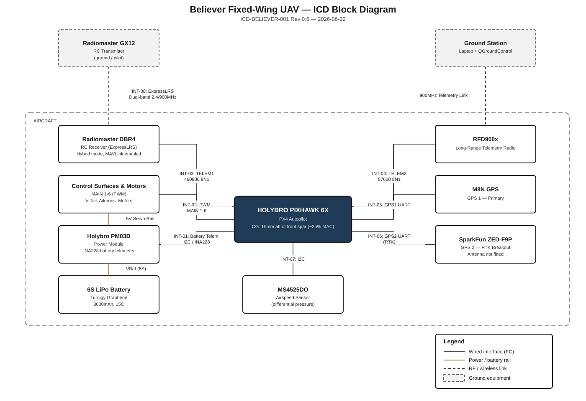
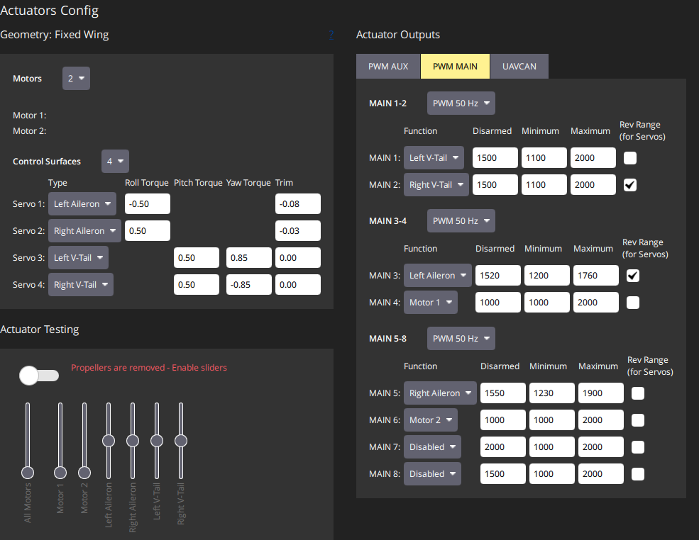
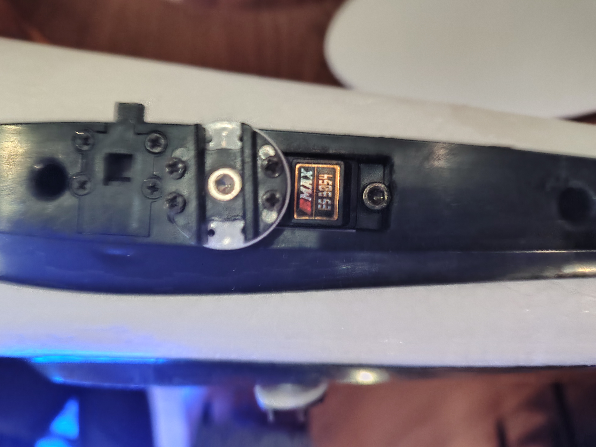
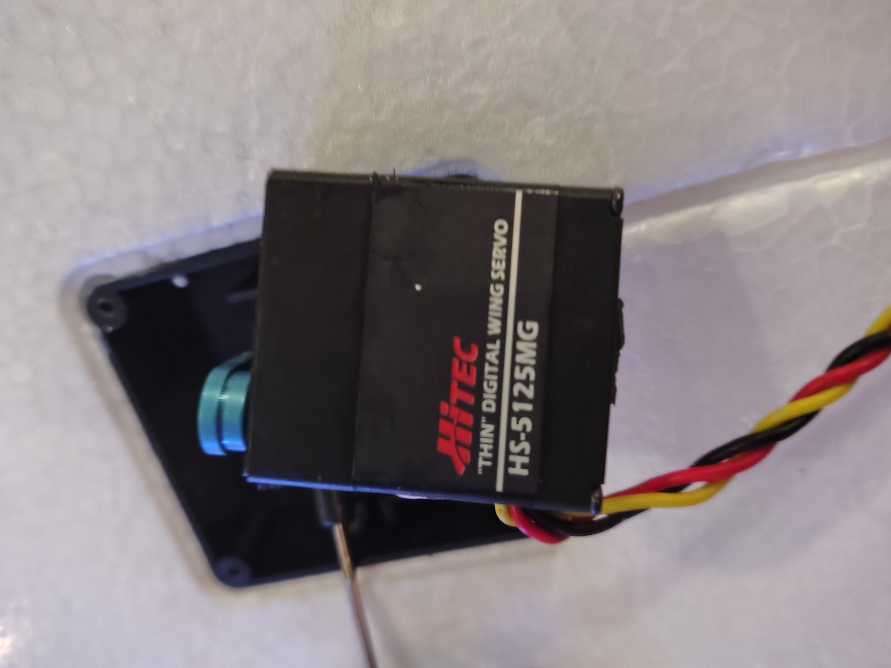
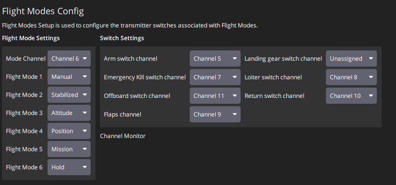
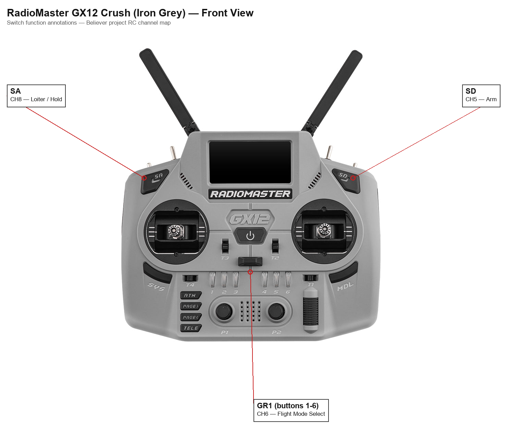
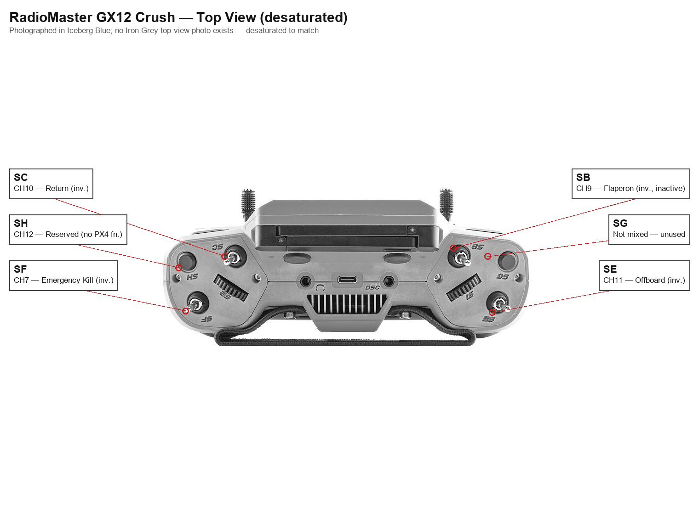
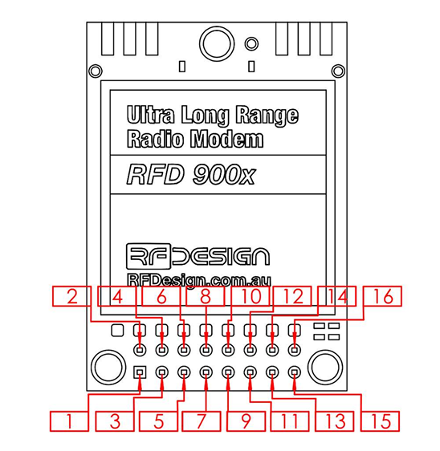

# Believer Fixed-Wing UAV - Interface Control Document

| | |
|---|---|
| **Document** | ICD-BELIEVER-001 |
| **Revision** | 2.4 |
| **Date** | 2026-09-02 |
| **Status** | Draft |

## 1. Scope

This document defines the physical, electrical, and data interfaces between the avionics subsystems of the Believer fixed-wing UAV: the flight controller (FC), power module, control surface and motor actuators, telemetry and RC radio links, GPS receivers, and the airspeed sensor.

## 2. Reference Documents

- Believer Project Proposal (QUTAS, 2026-01-25) - `docs/project/reference/`
- QUTAS EER Funding Application (2026-05-20) - `docs/project/reference/`
- Purchase invoices - `docs/project/purchase-history/invoices/`
- PX4 parameter change history - `docs/operations/Pixhawk Parameter Backup/parameter-change-log.md`
- Component datasheets - `Component datasheets/`

## 3. System Description

The Believer is a V-tail, twin-motor fixed-wing airframe. The flight controller is a Holybro Pixhawk 6X running PX4. Centre of gravity is located 15mm aft of the front wing spar carbon rod centreline, approximately 25% of the mean aerodynamic chord (MAC).

The servo rail is electrically isolated from the main flight controller power supply and is fed independently at 5V from a dedicated UBEC (see INT-01).

## 4. System Block Diagram

## 5. Interface Summary

| ID | Interface | Type | Endpoint A | Endpoint B |
|---|---|---|---|---|
| INT-01 | Power distribution | Power | Holybro PM03D power module, ZTW UBEC 10A | FC, servo rail (5V) |
| INT-02a | V-Tail Left servo (MAIN 1) | PWM | FC MAIN 1 | Emax ES3054 |
| INT-02b | V-Tail Right servo (MAIN 2) | PWM | FC MAIN 2 | Emax ES3054 |
| INT-02c | Left Aileron servo (MAIN 3) | PWM | FC MAIN 3 | Hitec HS-5125MG |
| INT-02d | Left Motor (MAIN 4) | PWM | FC MAIN 4 | T-MOTOR MN3110 KV700 (via T-Motor AIR 40A ESC) |
| INT-02e | Right Aileron servo (MAIN 5) | PWM | FC MAIN 5 | Hitec HS-5125MG |
| INT-02f | Right Motor (MAIN 6) | PWM | FC MAIN 6 | T-MOTOR MN3110 KV700 (via T-Motor AIR 40A ESC) |
| INT-03 | RC control link | Serial, TELEM1 | FC | Radiomaster DBR4 receiver |
| INT-04 | Telemetry link | Serial, TELEM2 | FC | RFD900x radio modem |
| INT-05 | GPS instance 1 (primary, RTK-capable) | Serial, physical GPS2 UART | FC | SparkFun GPS-RTK-SMA Breakout (ZED-F9P) |
| INT-06 | GPS instance 2 (secondary) | Serial, physical GPS1 UART | FC | M8N GPS module |
| INT-07 | Airspeed sensor | I2C | FC | MS4525DO differential pressure sensor |
| INT-08 | RC transmitter link | RF, ExpressLRS dual-band (2.4GHz/900MHz) | Radiomaster GX12 transmitter | Radiomaster DBR4 receiver |

Open items against this interface set are tracked in [context/open-items.md](../../context/open-items.md).

## 6. Interface Definitions

### INT-01 - Power Distribution

Power module: Holybro PM03D. Servo rail: dedicated ZTW UBEC 10A, installed 2026-08-19.

| Characteristic | Value |
|---|---|
| Battery telemetry | INA228 voltage/current monitor (`SENS_EN_INA228` enabled; `Component datasheets/ina228-datasheet.pdf`) |
| Battery | 6S LiPo (`BAT1_N_CELLS` = 6S) |
| Servo rail | 5V, electrically isolated from main FC supply, fed by a dedicated ZTW UBEC 10A (peak) / 6A continuous, adjustable 5.0/5.5/6.0V output, set to 5.0V. The PM03D's 3A-limited BEC no longer supplies the servo bus. |

**Servo Rail UBEC - ZTW UBEC 10A**

| Characteristic | Value |
|---|---|
| Output voltage | Adjustable 5.0V / 5.5V / 6.0V (set to 5.0V) |
| Continuous current | 6A |
| Peak current | 10A |

A servo-rail load test (control surfaces under stress, servo rail voltage monitored on an oscilloscope) is tracked as a non-blocking follow-up - see `docs/project/build-checklist.md` PWR-03.

### INT-02a through INT-02f - Actuator Outputs (PWM MAIN 1-6)

All flight control surface and motor servos connect to the FC's PWM outputs.

| Control Input | PWM Output | Min (µs) | Max (µs) | Disarmed (µs) | Trim (µs) | Reversed |
|---|---|---|---|---|---|---|
| V-Tail Left | MAIN 1 | 1000 | 2000 | 1500 | 1500 | No |
| V-Tail Right | MAIN 2 | 1000 | 2000 | 1500 | 1500 | Yes |
| Left Aileron | MAIN 3 | 1100 | 2000 | 1500 | 1500 | Yes |
| Left Motor | MAIN 4 | 1000 | 2000 | 1000 | 1000 | No |
| Right Aileron | MAIN 5 | 1100 | 2000 | 1500 | 1500 | No |
| Right Motor | MAIN 6 | 1000 | 2000 | 1000 | 1000 | No |

Endpoints independently remeasured as actual safe mechanical limits per servo and reconfirmed 2026-09-02 (`docs/project/build-checklist.md` CTL-06) - superseding the previous asymmetric values, which had conflated PWM endpoint selection with an attempt at aerodynamic aileron differential (see Control Surface Mixing below and CTL-06's background notes). Disarmed/trim values reset to 1500 across all four control surfaces now that they are no longer being used to approximate differential.

#### Control Surface Mixing

Roll/pitch/yaw torque contribution and mixer trim per control surface, as configured on the Actuators page (`CA_SV_CSx_*` parameters).

| Servo | Surface | Roll Torque | Pitch Torque | Yaw Torque | Mixer Trim |
|---|---|---|---|---|---|
| 1 | Left Aileron | -0.50 | 0.00 | 0.00 | 0.05 |
| 2 | Right Aileron | 0.50 | 0.00 | 0.00 | -0.05 |
| 3 | Left V-Tail | 0.00 | 0.50 | 0.50 | 0.00 |
| 4 | Right V-Tail | 0.00 | 0.50 | -0.50 | 0.00 |

V-tail yaw-effectiveness coefficients restored 2026-09-02 from ±0.85 to the PX4 type-default ±0.50 (`docs/project/build-checklist.md` CTL-06) - the ±0.85 pair had been mistakenly treated as an "85% rudder mix" (a conventional transmitter-mixer percentage), when these are actually actuator-effectiveness coefficients used by the control allocator; see CTL-06's background notes for the full explanation. Aileron mixer trims rechecked and updated following the CTL-06 PWM endpoint recalibration - no longer the 2026-07-10 TMAC session's original values. Pitch and yaw on the V-tail servos are both driven through PX4's ruddervator mixing (Section on the V-tail actuator outputs above).

#### Connected Devices

| PWM Output | Function | Device |
|---|---|---|
| MAIN 1 | V-Tail Left | Emax ES3054 (V-tail servo) |
| MAIN 2 | V-Tail Right | Emax ES3054 (V-tail servo) |
| MAIN 3 | Left Aileron | Hitec HS-5125MG (wing servo) |
| MAIN 4 | Left Motor | T-MOTOR MN3110 KV700 (via T-Motor AIR 40A ESC) |
| MAIN 5 | Right Aileron | Hitec HS-5125MG (wing servo) |
| MAIN 6 | Right Motor | T-MOTOR MN3110 KV700 (via T-Motor AIR 40A ESC) |

**V-Tail Servos (MAIN 1, MAIN 2) - Emax ES3054**

| Characteristic | Value |
|---|---|
| Type | Digital, metal gear |
| Weight | 17g |
| Dimensions | 28.45 x 13.00 x 31.10mm |
| Operating voltage | 4.8 - 6.0V |
| Torque @ 4.8V / 6.0V | 3.0 / 3.5 kg.cm |
| Speed @ 4.8V / 6.0V | 0.15 / 0.13 sec/60° |
| Spline | 23T |

**Aileron Servos (MAIN 3, MAIN 5) - Hitec HS-5125MG**

| Characteristic | Value |
|---|---|
| Type | Digital, metal gear, slim wing |
| Weight | 24g |
| Dimensions | 30 x 10 x 34mm |
| Operating voltage | 4.8 - 6.0V |
| Torque @ 4.8V / 6.0V | 3.0 / 3.5 kg.cm |
| Speed @ 4.8V / 6.0V | 0.17 / 0.13 sec/60° |
| Spline | Micro 25T |

**Motors (MAIN 4, MAIN 6) - T-MOTOR MN3110 KV700**

Installed 2026-08-19, replacing the T-Motor U5 v2.0 KV400 motors.

| Characteristic | Value |
|---|---|
| KV | 700 |
| Max continuous current | 21A |
| ESC | T-Motor AIR 40A (one per motor) |
| Propeller | 11x7" (Hobbyrama LP11X7E), carried over from the previous motor installation |
| Propeller rotation | Both propellers rotate clockwise (viewed from the body reference plane) - same handedness, not contra-rotating. Confirmed not a problem for the maiden flight; contra-rotation is not required. |

Datasheet: `Component datasheets/tmotor-mn3110-kv700-motor-datasheet.pdf` (covers the KV470/700/780 family). The previously-fitted T-Motor U5 v2.0 KV400 motors have been removed; their load-test report remains at `Component datasheets/tmotor-u5-kv400-motor-test-report.pdf` for historical reference.

**ESCs (MAIN 4, MAIN 6) - T-Motor AIR 40A**

Installed 2026-08-19 (one per motor), replacing the previously-fitted, unidentified-model ESCs. Calibrated so both motors start simultaneously on throttle-up.

| Characteristic | Value |
|---|---|
| Continuous current | 40A |
| Peak current | 60A (10s) |
| Voltage range | 2-6S LiPo |
| Weight | 26g |
| Dimensions | 68 x 25 x 8.7mm |
| BEC | None |
| Signal input | Analog PWM/OneShot-style, up to 621Hz refresh rate (per manufacturer); DShot support not confirmed |

Manual: `Component datasheets/tmotor-air-40a-esc-manual.pdf`.

Static thrust has been bench-tested and appears adequate but is not yet conclusively verified; throttle curve/mapping may also need remapping. Both tracked separately under `docs/project/build-checklist.md` (PROP-02, PROP-06).

### INT-03 - RC Control Link (TELEM1)

Radiomaster DBR4 dual-band (2.4GHz/900MHz) ExpressLRS receiver, connected to FC TELEM1. Operating mode: ELRS Hybrid switch mode with MAVLink enabled. Paired transmitter: Radiomaster GX12 (INT-08).

Relocated 2026-08-19 to the rear of the aircraft, away from the main avionics bay. Antenna orientation (orthogonal mounting) is tracked separately - see `docs/project/build-checklist.md` RF-05.

| Parameter | Value |
|---|---|
| `RC_PORT_CONFIG` | TELEM 1 |
| `SER_TEL1_BAUD` | 460800 8N1 |
| `RC_MAP_ARM_SW` | Channel 5 |
| `RC_MAP_KILL_SW` | Channel 7 |
| `MAV_1_CONFIG` | TELEM 1 |
| `MAV_1_MODE` | Normal |
| `MAV_1_RATE` | 19200 B/s |

ELRS Hybrid mode carries RC channels through CH12 only (CH13–16 are not transmitted).

A MAVLink telemetry stream (instance MAV_1, device `/dev/ttyS6`) is tunnelled over this same link alongside RC control. `BATTERY_STATUS` is forced to 10Hz via a `mavlink stream` command in `/fs/microsd/etc/extras.txt`. This override was configured while `MAV_1_MODE` was 3 (OSD, 0.5Hz default); the mode has since changed to 0 (Normal) - the resulting `BATTERY_STATUS` rate has not been re-verified against Normal mode's own default.

#### RC Channel Map

| Channel | Function | Notes |
|---|---|---|
| CH1 | Roll | Stick |
| CH2 | Pitch | Stick |
| CH3 | Throttle | Stick |
| CH4 | Yaw | Stick |
| CH5 | Arm | Latching; disarmed at startup |
| CH6 | Flight-mode selector (GR1) | Six-position switch group, defaults to SW2 |
| CH7 | Emergency kill | Inverted in EdgeTX |
| CH8 | Loiter / Hold | Latching; overrides the GR1-selected mode |
| CH9 (SB) | Flaperon control / spare | Inverted in EdgeTX; inactive for maiden flight. Dual-purpose as of 2026-09-02 (CTL-04): SB also locally selects the aileron tri-rate curve (100/70/50%) in EdgeTX - CH9's PX4-facing signal is unchanged |
| CH10 | Return | Inverted in EdgeTX |
| CH11 (SE) | Offboard | Inverted in EdgeTX. Dual-purpose as of 2026-09-02 (CTL-04): SE also locally selects the elevator tri-rate curve (100/70/50%) in EdgeTX - CH11's PX4-facing signal is unchanged, still mapped to `RC_MAP_OFFB_SW`. This creates an unresolved overlap: flipping elevator rate in flight also moves CH11 - see `docs/project/build-checklist.md` CTL-04 |
| CH12 | Spare / future buzzer or payload | Mixed from SH switch in EdgeTX; no PX4 function currently assigned |

#### GX12 Physical Switch Locations

#### Flight-Mode Mapping (GR1)

| Switch Position | PX4 Mode |
|---|---|
| SW1 | Manual |
| SW2 | Acro |
| SW3 | Stabilized |
| SW4 | Altitude |
| SW5 | Position |
| SW6 | Mission |

Hold was removed from the GR1 group and replaced with Acro (2026-08-19) - Hold and CH8's Loiter override commanded the same PX4 mode, so the GR1 slot was freed for Acro rather than duplicating Hold. Hold remains reachable via CH8 (`RC_MAP_LOITER_SW`), unchanged.

### INT-04 - Telemetry Link (TELEM2)

RFD900x long-range telemetry radio modem, connected to FC TELEM2 per the RFD900 datasheet.

| Wire Colour | RFD900 Pin | FC Pin |
|---|---|---|
| Black | GND | GND |
| Brown | Vcc | 5V |
| Yellow | Rx | TX1 |
| Red | Tx | RX1 |

| Parameter | Value |
|---|---|
| `MAV_0_CONFIG` | TELEM 2 |
| `MAV_0_MODE` | Normal |
| `SER_TEL2_BAUD` | 57600 8N1 |
| `MAV_0_RATE` | 3000 B/s |
| `MAV_0_FLOW_CTRL` | Disabled |

Device `/dev/ttyS4`. `BATTERY_STATUS` is forced to 5Hz via a `mavlink stream` command in `/fs/microsd/etc/extras.txt`, overriding the Normal mode default.

#### RFD900x Connector Pinout (full 16-pin)

| Pin | Signal | Direction | Function | Level |
|---|---|---|---|---|
| 1 | GND | - | Ground | 0V |
| 2 | GND | - | Ground | 0V |
| 3 | CTS | Input | Clear to send | 3.3V |
| 4 | Vcc | - | Power supply | 5V |
| 5 | Vusb | - | Power supply from USB | 5V |
| 6 | Vusb | - | Power supply from USB | 5V |
| 7 | RX | Input | UART Data In | 3.3V |
| 8 | GPIO5/P3.4 | I/O | Digital I/O | 3.3V |
| 9 | TX | Output | UART Data Out | 3.3V |
| 10 | GPIO4/P3.3 | I/O | Digital I/O | 3.3V |
| 11 | RTS | Output | Request to send | 3.3V |
| 12 | GPIO3/P1.3 | I/O | Digital I/O | 3.3V |
| 13 | GPIO0/P1.0 | I/O | Digital I/O | 3.3V |
| 14 | GPIO2/P1.2 | I/O | Digital I/O | 3.3V |
| 15 | GPIO1/P1.1 | I/O | Digital I/O, PPM I/O | 3.3V |
| 16 | GND | - | Ground | 0V |

### INT-05 - GPS Instance 1 (Primary) - ZED-F9P

**Physical wiring is unchanged from earlier revisions of this document - only the PX4 driver instance numbering has changed, deliberately, as of 2026-09-02.** The SparkFun GPS-RTK-SMA Breakout (u-blox ZED-F9P) remains physically connected to the FC's **GPS2 UART port**, but `GPS_1_CONFIG` now points PX4's GPS driver **instance 1** at that port, making the RTK-capable unit the primary-numbered GPS instance. External mount and antenna installed 2026-08-28 (`docs/project/build-checklist.md` NAV-03/NAV-04). GPS lock confirmed on both receivers, 2026-09-02 (NAV-05).

**Rationale for the swap:** QGroundControl's primary GPS status indicator in the flight view reads the `GPS_RAW_INT` MAVLink message, which PX4 populates from GPS driver instance 1. With the ZED-F9P on instance 2 (the pre-2026-09-02 configuration), QGC's main display would have shown the M8N's lesser fix status rather than the actual best-available GPS quality - under-reporting to the pilot. Placing the RTK-capable receiver on instance 1 ensures the primary GUI indicator reflects it.

| Parameter | Value |
|---|---|
| `GPS_1_CONFIG` | 202 (physical GPS2 UART port) |
| `GPS_1_PROTOCOL` | 1 (u-blox) |
| `GPS_1_GNSS` | 31 |

### INT-06 - GPS Instance 2 (Secondary) - M8N

The u-blox M8N remains physically connected to the FC's **GPS1 UART port**. `GPS_2_CONFIG` now points PX4's GPS driver **instance 2** at that port - the physical wiring has not moved, only the instance numbering.

| Parameter | Value |
|---|---|
| `GPS_2_CONFIG` | 201 (physical GPS1 UART port) |
| `GPS_2_PROTOCOL` | 1 (u-blox) |
| `GPS_2_GNSS` | 29 |

**Instance-vs-port cross-reference, to avoid confusion:** PX4's `GPS_x_CONFIG`/`GPS_x_GNSS`/`GPS_x_PROTOCOL` parameters are numbered by **logical driver instance** (1 or 2), which is independent of and now deliberately decoupled from the **physical UART port** number (GPS1 or GPS2) - instance 1 reads the physical GPS2 port (ZED-F9P), instance 2 reads the physical GPS1 port (M8N). Serial port parameters (e.g. `SER_GPS2_BAUD`) are named by **physical port**, not instance, and so apply to whichever device is physically wired there regardless of which instance number reads it. `GPS_UBX_DYNMODEL` (8, Airborne <4g) is a global u-blox driver setting, not scoped to a single instance, and applies to both receivers.

GPS instance 1 (ZED-F9P) and instance 2 (M8N) are blended by PX4 rather than one being treated as an exclusive "primary" - `SENS_GPS_MASK` (currently 7 in the exported parameters) governs this; NAV-05 should confirm its bit semantics against the PX4 documentation for the installed firmware version and verify it produces the intended blended behaviour, weighting the more accurate receiver (expected to be the ZED-F9P, particularly once RTK corrections are available) while retaining the M8N as an automatic fallback. GPS lock confirmation for this configuration is still outstanding - see `docs/project/build-checklist.md` NAV-05.

### INT-07 - Airspeed Sensor (I2C)

MS4525DO differential pressure sensor, connected to the Pixhawk 6X I2C port (JST-GH 4-pin).

| Characteristic | Value |
|---|---|
| Port | Pixhawk 6X I2C (JST-GH 4-pin: VCC, SCL, SDA, GND) |
| I2C address | 0x28 (default) |

| Parameter | Value |
|---|---|
| `SENS_EN_MS4525DO` | 1 (Enabled) |
| `SENS_EXT_I2C_PRB` | 1 (Enabled) |

### INT-08 - RC Transmitter Link

Radiomaster GX12 Crush ExpressLRS transmitter (Iron Grey) - Gemini-X dual-band, 2.4GHz and 900MHz simultaneous. Pairs with the Radiomaster DBR4 receiver (INT-03) in ELRS Hybrid switch mode with MAVLink enabled. Physical switch locations and functions are shown in INT-03.

Packet rate: 100Hz Full.

## 7. Open Items

Tracked in [context/open-items.md](../../context/open-items.md).

## 8. Revision History

| Rev | Date | Description |
|---|---|---|
| 0.1 | 2026-06-21 | Initial issue |
| 0.2 | 2026-06-21 | Added power, GPS, and telemetry interface detail |
| 0.3 | 2026-06-21 | Added RC channel map and flight-mode mapping |
| 0.4 | 2026-06-21 | Confirmed power module and GPS routing; rewritten for clarity |
| 0.5 | 2026-06-21 | Added system block diagram |
| 0.6 | 2026-06-22 | Redrawn block diagram with orthogonal routing, uniform box sizing, and a white background |
| 0.7 | 2026-06-22 | Confirmed CH12 (SH switch) routing against the GX12 EdgeTX radio backup and the QGC Flight Modes Config screenshot; added screenshot |
| 0.8 | 2026-06-22 | Corrected INT-08: transmitter is the GX12 **Crush** (Iron Grey), not the standard GX12. Added annotated front/top switch-location diagrams |
| 0.9 | 2026-07-02 | Added INT-02 connected device specs: V-tail servos (Emax ES3054), aileron servos (Hitec HS-5125MG), motors (T-Motor U5 v2.0 KV400). ESC identified as T-Motor branded, model TBD |
| 1.0 | 2026-07-03 | Split INT-02 into INT-02a-f (one interface per PWM output); added full 16-pin RFD900x connector pinout table under INT-04; updated block diagram to show individual actuator connections |
| 1.1 | 2026-07-03 | Added INT-07 I2C port and address detail |
| 1.2 | 2026-07-05 | Added INT-08 ELRS packet rate; added MAV_1 (TELEM1/DBR4) and MAV_0 (TELEM2/RFD900x) MAVLink instance parameters, device paths, and BATTERY_STATUS rate overrides |
| 1.3 | 2026-07-06 | Updated `MAV_1_MODE` (OSD -> Normal) per the current parameter export; flagged that the BATTERY_STATUS extras.txt override has not been re-verified against Normal mode's default rate |
| 1.4 | 2026-07-16 | Removed a stray UTF-8 BOM causing garbled rendering; added the PM03D's 3A servo rail current limit, confirmed against the manufacturer datasheet (`Component datasheets/holybro-pm03d-manual.pdf`) |
| 1.5 | 2026-07-16 | Recreated the block diagram: fixed a routing bug where the GX12-DBR4 RF link visually terminated on the V-Tail Left servo box instead of the DBR4 box; regrouped ground equipment (GX12, Ground Station) together above their onboard RF counterparts; rerouted the Ground Station-RFD900x link around the DBR4 box instead of crossing through it; rerouted PM03D-FC power to enter via the FC's top edge, clear of the PWM bus and airspeed connection; re-centred the MS4525DO box under the FC; updated the propeller label (11x4.7" -> 11x7" Hobbyrama LP11X7E) and revision footer |
| 1.6 | 2026-07-17 | Corrected the INT-02a-f actuator table against the actual exported parameters (`params/believer-parameters.params`), which it had never matched since the table was first written (Rev 1.0, before the 2026-07-05/07-06 radio calibration and ruddervator direction fix): MAIN 1 Min/Max corrected to 800/2000us and Reversed corrected to No; MAIN 2 Min/Max corrected to 800/2000us and Reversed corrected to Yes; MAIN 3 Min/Max corrected to 1000/2000us; MAIN 4 and MAIN 6 Min/Max corrected to 1100/1900us. Updated the stale "reverse-pitch prop TBD" note (resolved by the 2026-07-14 9x6" propeller purchase) to reference the pending MN3110 upgrade instead |
| 1.7 | 2026-07-17 | Recorded two T-Motor AIR 40A ESCs acquired to pair with the MN3110 KV700 motor upgrade (not yet installed - `docs/project/build-checklist.md` PROP-01); added a spec table for the incoming ESC alongside the existing currently-fitted-ESC photos |
| 1.8 | 2026-07-17 | Cross-referenced newly-sourced datasheets: INA228 (INT-01), T-Motor U5 KV400 load-test report, and T-Motor AIR 40A ESC manual - all added to `Component datasheets/` |
| 1.9 | 2026-08-19 | Recorded the MN3110 KV700/AIR 40A propulsion install (replacing the U5 KV400 motors and previously-fitted ESCs), the dedicated servo-rail UBEC (replacing PM03D as the servo rail source), DBR4 relocation to the rear of the aircraft, and the finalised aileron trim/V-tail yaw mixing values from the 2026-07-10 TMAC session. Updated the INT-02a-f actuator table and added a Control Surface Mixing subsection against the current exported parameters and QGroundControl Actuators Config screenshot. Updated the GR1 flight-mode mapping (Acro added, Hold removed from the group, still reachable via CH8) |
| 2.0 | 2026-08-28 | Updated INT-06: recorded the ZED-F9P external mount and antenna installation (NAV-03/NAV-04), removed the stale "antenna not yet fitted, maiden flight blocker" note (superseded and was never actually a hard blocker), and documented the decision to blend GPS 1/GPS 2 via `SENS_GPS_MASK` rather than designate a single "primary" GPS, per Julian - pending NAV-05 confirming the parameter's bit semantics for the installed PX4 version |
| 2.1 | 2026-08-28 | Corrected `GPS_1_GNSS` in INT-05 from 21 to 0 (Default) - the documented value never matched the live exported parameters, caught during a review of GPS parameter recommendations |
| 2.2 | 2026-09-02 | Rewrote INT-05/INT-06: GPS driver instance numbering deliberately swapped relative to physical UART port (instance 1 = ZED-F9P via physical GPS2 port, instance 2 = M8N via physical GPS1 port) - physical wiring unchanged, added an explicit instance-vs-port cross-reference to prevent confusion. Updated the INT-02a-f actuator table with CTL-06's physically remeasured PWM endpoints (superseding the previous asymmetric, differential-approximating values) and the Control Surface Mixing table with the restored ±0.50 V-tail yaw effectiveness and rechecked aileron trims |
| 2.3 | 2026-09-02 | NAV-05 closed - recorded GPS lock confirmation on both receivers and the QGroundControl-display rationale for the instance swap (QGC's primary GPS status indicator reads driver instance 1; the swap ensures it reflects the RTK-capable ZED-F9P rather than the M8N) |
| 2.4 | 2026-09-02 | Updated the RC channel map for CTL-04's tri-rate implementation: verified against the actual EdgeTX radio backup (`model00.yml`) that CH9/CH11's `mixData` routing is unchanged - SB and SE remain dual-purpose, still driving Flaperon control (CH9) and Offboard (CH11) exactly as before, while also now locally selecting the aileron/elevator rate curves via a separate `expoData` feature. The overlap between elevator rate switching and `RC_MAP_OFFB_SW` is tracked as an open item and in `docs/project/build-checklist.md` CTL-04 |
