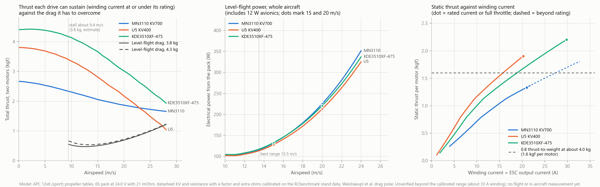

# Powertrain Performance Model

| | |
|---|---|
| **Date** | 2026-09-28 |
| **Scope** | Steady-state thrust, current and power of the twin-motor drive with the 12x6" propeller on 6S, against the airframe's drag |
| **Status** | Model calibrated on static thrust-stand data only. Not yet compared with in-aircraft or flight measurements |
| **Inputs** | APC PER3 propeller performance tables, RCbenchmark stand data (`docs/engineering/test-reports/2026-09-15-mn3110-thrust-stand-characterisation.md`), motor datasheets and listings, the wind-tunnel drag polar of the reference airframe (`docs/engineering/references/weishaupl-et-al-2024-drag-curves-small-fixed-wing-uavs.pdf`) |

## 1. Summary

All values are for the APC 12x6" (sport) propeller on 6S with the pack at 24.0 V, at the maiden mass of 3.8 kg plus the change in motor-pair mass. The design mass adds an estimated 190 g of payload (no headroom).

**Static thrust per motor, held to the motor's rated winding current**

| Motor | Rated current | Static thrust per motor | Winding current | Static thrust-to-weight, maiden mass | Static thrust-to-weight, design mass |
|---|---|---|---|---|---|
| MN3110 KV700 (installed) | 21 A (180 s) | 1.33 kgf | 21 A (at the rating) | 0.70 (3.80 kg) | 0.67 (3.99 kg) |
| U5 KV400 | 30 A (180 s) | 1.90 kgf (full throttle) | 20.2 A (67% of rating) | 0.96 (3.95 kg) | 0.92 (4.14 kg) |
| KDE3510XF-475 | 30 A (180 s) | 2.20 kgf (full throttle) | 29.8 A (99% of rating) | 1.13 (3.88 kg) | 1.08 (4.07 kg) |
| MN3510 KV700 (6S unconfirmed) | 25 A (180 s) | 1.49 kgf | 25 A (at the rating) | 0.78 (3.83 kg) | 0.74 (4.02 kg) |
| SunnySky X2814 KV900 (listed 3-4S) | 50 A (30 s) | 2.02 kgf | 50 A (at the rating) | 1.05 (3.86 kg) | 1.00 (4.05 kg) |

The two stand points for the installed motor correspond to a winding current of 25.0 A (119% of rating) at 1.5 kgf (1600 us) and 29.9 A (143%) at 1.7 kgf (1700 us). The model's bus current at those points is within about 6% of the measured 14.1 A and 19.3 A. The rating is reached at 1.33 kgf, about 1535 us.

**Thrust in flight against level-flight drag** (both motors, thrust held to each motor's rated winding current, drag at 3.8 kg)

| Speed | Drag | MN3110 | U5 | KDE |
|---|---|---|---|---|
| 15 m/s | 0.51 kgf | 2.05 kgf (4.0 times) | 2.81 kgf (5.5 times) | 3.67 kgf (7.2 times) |
| 20 m/s | 0.69 kgf | 1.86 kgf (2.7 times) | 2.17 kgf (3.1 times) | 3.02 kgf (4.4 times) |

**Level-flight power and range** (maiden mass, 215 Wh usable, 12 W avionics; payload power not included)

| Motor | Speed | Power from the pack | Winding current, share of rating | Endurance | Range |
|---|---|---|---|---|---|
| MN3110 | 15 m/s | 132 W | 33% | 98 min | 88 km |
| MN3110 | 20 m/s | 225 W | 46% | 57 min | 69 km |
| U5 | 15 m/s | 128 W | 14% | 101 min | 90 km |
| U5 | 20 m/s | 213 W | 19% | 61 min | 73 km |
| KDE | 15 m/s | 133 W | 17% | 97 min | 87 km |
| KDE | 20 m/s | 221 W | 23% | 58 min | 70 km |

- Best range is at 13.5 m/s for every motor (about 89 to 92 km). Best endurance is at 10.5 to 11 m/s (about 123 to 127 min), at or just above the estimated stall speed of about 9.4 m/s at 3.8 kg, so it is not a practical cruise speed.
- Flying at 20 m/s instead of 15 m/s costs about 65 to 70% more power and about 19 to 22% of the range.
- The motors differ by less than 6% in cruise power. Motor choice does not change cruise efficiency materially.
- Level top speed at full throttle is about 27 m/s for the U5 and about 31 m/s for the KDE.

## 2. Sensitivity

The U5 is the most sensitive to pack voltage and effective KV because it is speed-limited. Thrust is per motor at full throttle, static; thrust-to-weight uses the 3.95 kg maiden mass and the 4.14 kg design mass; the last two columns are total thrust in flight.

| Case | Static thrust | Thrust-to-weight, maiden | Thrust-to-weight, design | Thrust at 15 m/s | Thrust at 20 m/s (margin over drag) |
|---|---|---|---|---|---|
| Base (24.0 V pack, KV factor 1.0) | 1.90 kgf | 0.96 | 0.92 | 2.81 kgf | 2.17 kgf (3.1 times) |
| Pack at 22.2 V (mid-discharge) | 1.69 kgf | 0.85 | 0.82 | 2.32 kgf | 1.72 kgf (2.5 times) |
| Effective KV 10% low (factor 0.9) | 1.71 kgf | 0.87 | 0.83 | 2.32 kgf | 1.70 kgf (2.4 times) |
| Worst: 22.2 V and factor 0.9 | 1.51 kgf | 0.76 | 0.73 | 1.89 kgf | 1.28 kgf (1.8 times) |
| APC 12x6SF propeller | 2.25 kgf | 1.14 | 1.09 | 3.26 kgf | 2.61 kgf (3.8 times) |
| APC 12x6E propeller | 1.91 kgf | 0.97 | 0.92 | 2.55 kgf | 1.92 kgf (2.8 times) |

The full table for all five motors is in `results/sensitivity-summary.csv` (`docs/engineering/analysis/powertrain-model/results/`).

## 3. Method

Each motor, ESC, battery and propeller is solved in steady state at a given airspeed and throttle (ESC duty). Speed is found where the motor's shaft torque equals the propeller's torque.

- **Propeller:** APC PER3 tables, thrust `T = Ct(J, rpm) x rho x n^2 x D^4` and shaft power `P = Cp(J, rpm) x rho x n^3 x D^5`, with `J = V / (n x D)`; torque is `P / (2 x pi x n)`. Air density 1.19 kg/m3.
- **Motor:** back-EMF `E = rpm / (KV x f)`; winding current `I = (Vm - E) / Reff`; torque `(I - I0) x 9.549 / (KV x f)`. `Reff = 1.15 x R + b`, where the 1.15 covers copper heating and `b` is the extra series resistance of the ESC, wiring and connectors.
- **ESC:** buck converter, `Vm = duty x Vbat`, `I_bus = duty x I / 0.98`. Winding current equals the current through the ESC's power stage.
- **Battery:** `Vbat = Voc - Rpack x total bus current`, with `Rpack` = 21 mOhm (measured for the custom 6S4P pack).
- **Airframe:** `D = q x S x (CD0 + K x CL^2)`, `CL = W / (q x S)`; `CD0` = 0.0503, `K` = 0.0764, `S` = 0.488 m2 (wind tunnel).
- **Endurance and range:** 215 Wh usable (12.4 Ah nominal, 21.6 V, 80% usable) less 12 W of avionics.

| Motor | KV | R (mOhm) | No-load current | Rating | Bare mass |
|---|---|---|---|---|---|
| MN3110 KV700 | 700 | 92 | 0.3 A | 21 A, 466 W (180 s) | 80 g |
| U5 KV400 | 400 | 116 | 0.3 A | 30 A, 850 W (180 s) | 156 g |
| KDE3510XF-475 | 475 | 105 | 0.5 A (assumed) | 30 A, 665 W (180 s) | 120 g |
| MN3510 KV700 | 700 | 50 | 0.5 A (assumed) | 25 A, 555 W (180 s) | 97 g |
| SunnySky X2814 KV900 | 900 | 33.6 | 1.0 A (assumed) | 50 A (30 s), 680 W | 108 g |

The MN3110 values are from its datasheet. The others are from manufacturer and reseller listings and are unverified.

## 4. Calibration and validation

The model was checked against the RCbenchmark stand data for the installed MN3110 with the APC 12x6" (bins of ESC command from 1400 to 1700 us) and the APC 11x7" (1400 to 1790 us). At each stand point the model is given the measured bus voltage and current, finds the ESC duty that reproduces that current, and predicts thrust.

| Propeller variant | Mean thrust error against the stand | RMS error |
|---|---|---|
| APC 12x6E (thin electric) | +13.8% | 13.8% |
| APC 12x6 (sport) | +2.3% | 4.0% |
| APC 12x6SF (slow flyer) | -1.4% | 2.2% |
| APC 11x7E | +9.9% | 10.6% |
| APC 11x7 (sport) | -1.7% | 7.5% |
| APC 11x7SF | -7.4% | 9.9% |

(KV factor `f` = 1.0 and `b` = 0.06 ohm.) The stand propellers behave like the sport or slow-flyer variants, not the thin-electric variants, which over-predict thrust for the measured electrical power. The base case uses the APC 12x6 (sport); the SF and E variants are in the sensitivity table.

The KV factor and the extra resistance cannot be separated from static stand data: a grid search over `f` from 0.85 to 1.05 and `b` from 0 to 0.12 ohm gives RMS errors of 5 to 6% across a wide range of pairs. The nominal values (`f` = 1.0, `b` = 0.06 ohm) are used, and the effect of a 10% lower effective KV is in the sensitivity table.

## 5. Limitations

- **Static calibration only.** Thrust and current in flight rest on APC's published (theoretical) tables. Expect an uncertainty of about 10 to 15% on in-flight thrust.
- **Calibrated range.** The model is calibrated to about 33 A winding current for the MN3110. Its full-throttle output for that motor (about 54 A winding) is beyond that range and beyond the AIR 40A ESC's rating, and is not used. The aircraft's logs at 2000 us show about 32 A per motor with the Hobbyrama 11x7" propeller, against about 54 A predicted for the APC 11x7" at full duty. The propellers differ, so this is not a like-for-like check, but full-throttle predictions should be treated as unreliable.
- **Throttle mapping.** Model throttle is the ESC's effective duty, not the PWM command. The mapping is unknown; the stand data imply about 0.70 duty at 1780 us with the 11x7".
- **Thermal state is not modelled.** Only currents are compared with ratings; the ratings are 180 s bench figures, and motor and ESC temperatures have not been measured.
- **Motor specifications** for the U5, KDE, MN3510 and X2814 are unverified listing values, and their no-load currents are assumed.
- **Battery capacity** is nominal; the capacity test has not been completed.
- **Not included:** payload power and drag (a Pi 4 and an O3 Air Unit together would add roughly 15 to 20 W), gusts, turns, and airspeed-dependent battery sag beyond the series resistance.

## 6. Reproducing the results

Scripts are in `docs/engineering/analysis/powertrain-model/`:

| File | Purpose |
|---|---|
| `apcprop.py` | Parser and interpolator for APC PER3 files |
| `powertrain_model.py` | The steady-state model and the stand-data calibration routines |
| `calibrate.py` | Propeller-variant comparison and the `f` and `b` grid search against the stand data |
| `performance_run.py` | Static, cruise, best-speed and full-throttle-curve tables for all motors (arguments: propeller file, pack open-circuit voltage, KV factor) |
| `make_figures.py` | The figure above |
| `build_summary.py` | The sensitivity summary |
| `results/` | Base-case tables and the sensitivity summary as CSV |

The APC files (`PER3_12x6.dat`, `PER3_12x6E.dat`, `PER3_12x6SF.dat`, `PER3_11x7.dat`, `PER3_11x7E.dat`, `PER3_11x7SF.dat`) are APC's published performance data and are not stored in the repository. They are available from APC (`apcprop.com/files/`), which blocks scripted downloads, and from the mirror `github.com/JARC99/apc-prop-analyzer` (`apc_data/performance/`). Place them next to the scripts. The stand CSV folder is set with the `BELIEVER_STAND_DIR` environment variable. Python with numpy, scipy, pandas and matplotlib is required.
