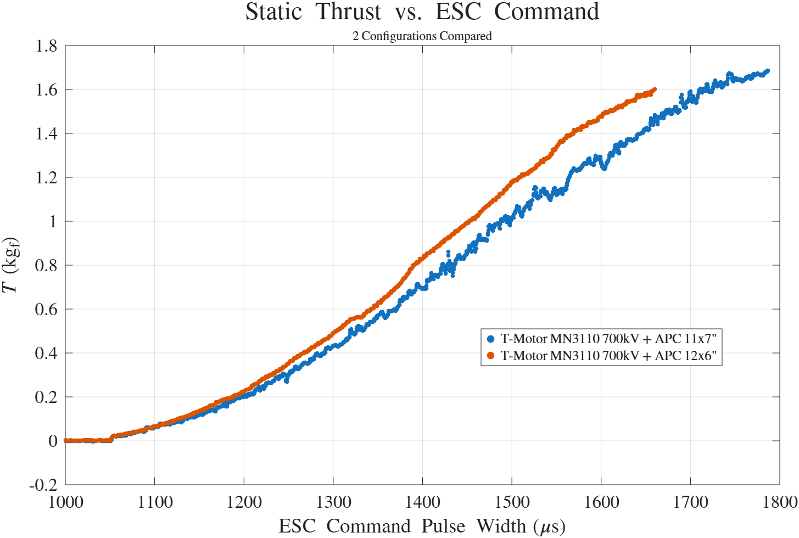
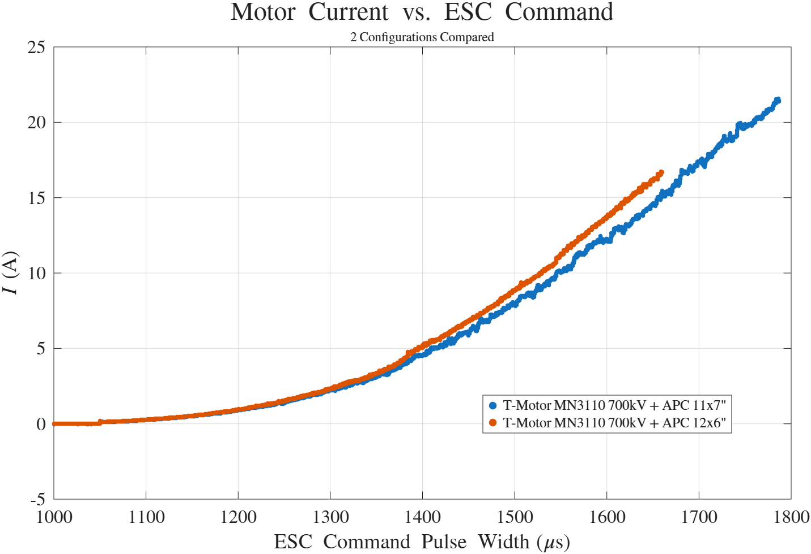
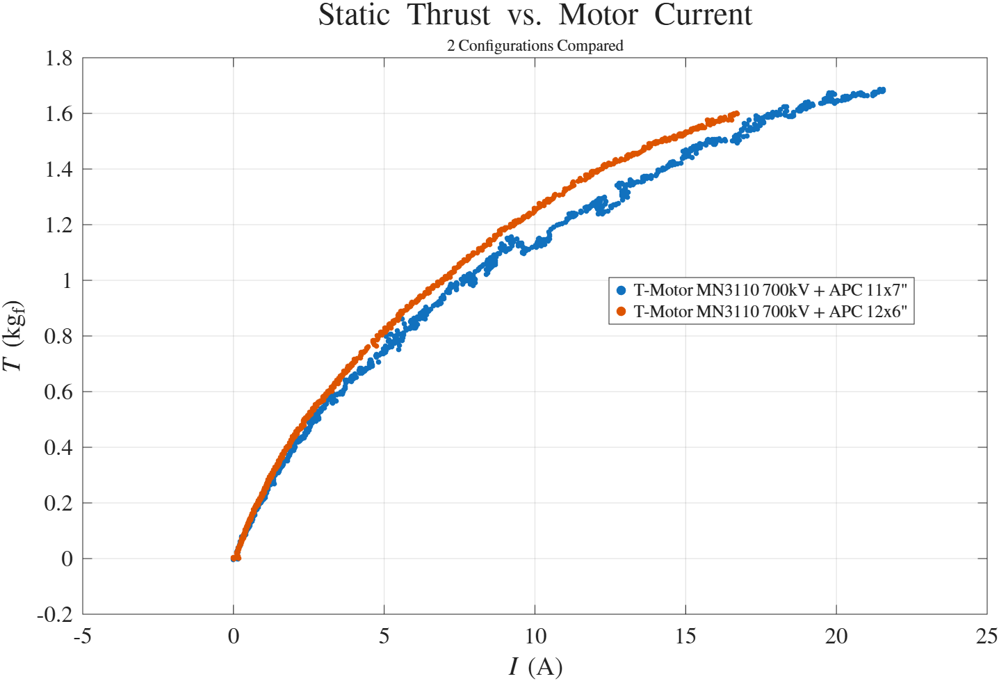
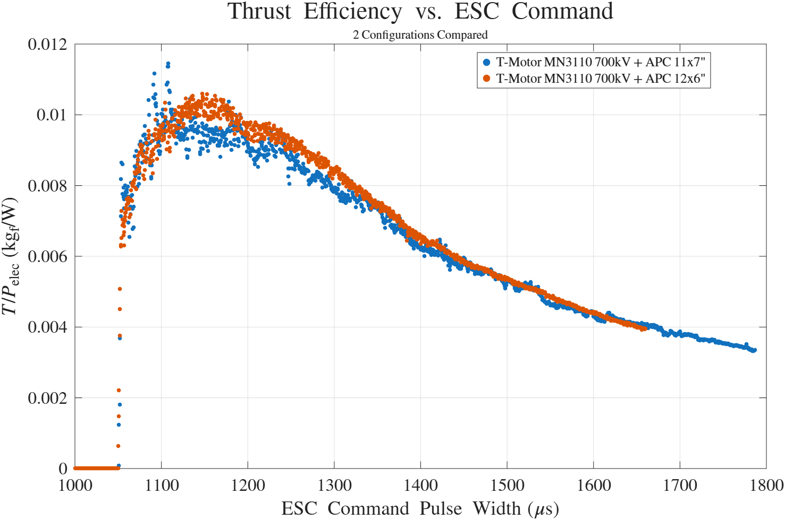

# Test Report - MN3110 KV700 Thrust Stand Characterisation

| | |
|---|---|
| **Date** | 2026-09-06 and 2026-09-10 (APC 11x7"), 2026-09-15 (APC 12x6"); combined plots produced 2026-09-26 |
| **Location** | RCbenchmark Series 1520 thrust stand |
| **Attendees** | Julian Williams |
| **Purpose** | Characterise thrust, current, power, and efficiency of the T-Motor MN3110 KV700 against ESC command for two candidate propellers, and derive a throttle ceiling that keeps each motor within its rated continuous current |

## Summary

The T-Motor MN3110 KV700 was run on the thrust stand with an APC 11x7" and an APC 12x6" propeller, sweeping the ESC command from 1000 us upward while logging thrust, voltage, current, and electrical power. The 12x6" propeller was selected for the aircraft. Limiting the ESC command to approximately 1700 us keeps each motor at about 19A, inside its 21A continuous rating, while producing approximately 1.7 kgf of static thrust per motor (about 3.4 kgf across both motors).

## Test Setup

| Item | Detail |
|---|---|
| Stand | RCbenchmark Series 1520 |
| Motor | T-Motor MN3110 KV700 |
| Propellers | APC 11x7" and APC 12x6" (as labelled on the plots) |
| ESC on the stand | TBD (not recorded in the logs) |
| Supply voltage | 11x7": approximately 23.4 to 24.5V under load. 12x6": approximately 24.0 to 25.1V under load (near-fully-charged pack) |
| Method | ESC command swept upward from 1000 us; a slow full sweep plus several shorter runs per propeller |
| Not recorded | Motor RPM (optical speed logged as zero) |

Raw RCbenchmark CSV logs and the MATLAB plotting scripts are held outside the repository, in Julian's MATLAB/QUTAS/Believer/Motor Testing folder (`MN3110_11_7` and `MN3110_12_6` subfolders).

## Findings

Mean values in 20 us ESC-command bins (the label is the start of each bin), from the raw logs:

| ESC command (us) | 11x7" current (A) | 11x7" thrust (kgf) | 11x7" power (W) | 12x6" current (A) | 12x6" thrust (kgf) | 12x6" power (W) |
|---|---|---|---|---|---|---|
| 1400 | 4.9 | 0.72 | 119 | 5.4 | 0.86 | 135 |
| 1480 | 7.7 | 0.98 | 187 | 8.4 | 1.14 | 208 |
| 1560 | 11.0 | 1.20 | 264 | 12.2 | 1.41 | 299 |
| 1600 | 12.6 | 1.28 | 302 | 14.1 | 1.50 | 345 |
| 1640 | 14.5 | 1.41 | 345 | 16.1 | 1.58 | 392 |
| 1680 | 16.7 | 1.51 | 394 | 18.2 | 1.68 | 441 |
| 1700 | 17.7 | 1.57 | 419 | 19.3 | 1.70 | 463 |
| 1740 | 19.7 | 1.65 | 465 | - | - | - |
| 1780 | 21.3 | 1.68 | 500 | - | - | - |

- **Propeller comparison.** The 12x6" draws more current than the 11x7" at the same ESC command and produces more thrust (19.3A and 1.70 kgf against 17.7A and 1.57 kgf at 1700 us). Part of that gap is the higher supply voltage in the 12x6" tests. At equal current the 12x6" gives about 5% more thrust near the ceiling (16 to 19A) and about 10% more at lower currents (6 to 12A), part of which again reflects the higher supply voltage. Efficiency is essentially identical above about 1400 us, with the 12x6" slightly better at low to mid throttle (about 1100 to 1350 us).
- **Current ceiling.** The 11x7" reaches 21.3A (the MN3110 KV700's rated continuous current) at about 1780 us, at 500W. The 12x6" reaches about 19.3A at 1700 us; a quadratic fit through its upper range puts 21A at roughly 1715 to 1730 us. A 1700 us ceiling therefore leaves about 2A of margin on the 12x6". The fit uses sparse data at the top end, so the 21A crossing point is approximate.
- **Static thrust at the ceiling.** About 1.7 kgf per motor at 1700 us (measured), and approximately 1.6 to 1.8 kgf per motor across the ceiling range, giving about 3.2 to 3.6 kgf of total static thrust from two motors. Against the 5.5 kg manufacturer MTOW that is a static thrust-to-weight ratio of about 0.62 (3.4 kgf); the actual all-up weight has not been recorded, so the true ratio is TBD.
- **Cross-check against flight-controller logs.** The 2026-09-02 thrust-test logs (11x7" propellers fitted to the aircraft) showed about 42A total current (about 21A per motor) at 1800 to 1809 us. The stand data gives 21.3A per motor (42.6A total) at 1780 us for the same propeller - close agreement, which supports applying the stand data to the aircraft.
- **Static is the worst case.** For a fixed-pitch propeller the current at a given ESC command is expected to fall as airspeed rises, so a ceiling set from static current should be conservative in flight.

## Limitations

- The stand cut out at around 500W, so the upper end of the range is sparse. The 11x7" runs reached 21.6A and 505W. The steady 12x6" sweep reached 16.7A at 1660 us; a few shorter 12x6" runs went higher (to 22.2A at 1761 us, and briefly to 40A at 1900 us) but are transient and not steady-state, so they are not used in the table above.
- The two propellers were not tested at the same supply voltage. Current at a given ESC command rises with voltage, so the propeller comparison is indicative, not exact. The 12x6" tests, on a near-fully-charged pack, represent the highest-current case for a full 6S pack.
- The stand tests used APC propellers. The aircraft documentation previously listed Hobbyrama LP11X7E propellers as fitted; results may not transfer exactly to a different make.
- No sustained hold at the ceiling was run (the sweeps are ramps), so this is not a sustained-current or thermal verification against the 180 s continuous rating.

## Actions Taken

- Julian selected the 12x6" propeller for the aircraft.
- No flight-controller parameters changed as part of this test report. `PWM_MAIN_MAX4`/`PWM_MAIN_MAX6` was 1800 at the last parameter export; the stand data recommends approximately 1700 us for the 12x6".

## Outstanding

- Set `PWM_MAIN_MAX4`/`PWM_MAIN_MAX6` to approximately 1700 and confirm via a parameter export - tracked under PROP-08.
- Sustained-run verification at the ceiling (current and motor temperature) - PROP-08.
- Record the all-up weight to convert the measured thrust to a thrust-to-weight ratio, and define the target ratio - PROP-10.
- Confirm the purchase and installation status of the 12x6" propellers, and check ground clearance for a 12" propeller - see `context/open-items.md`.

Full detail and task tracking: [`docs/project/build-checklist.md`](../../project/build-checklist.md) PROP-05, PROP-08, PROP-10. Provenance and decision history: [`context/project-notes.md`](../../../context/project-notes.md).
