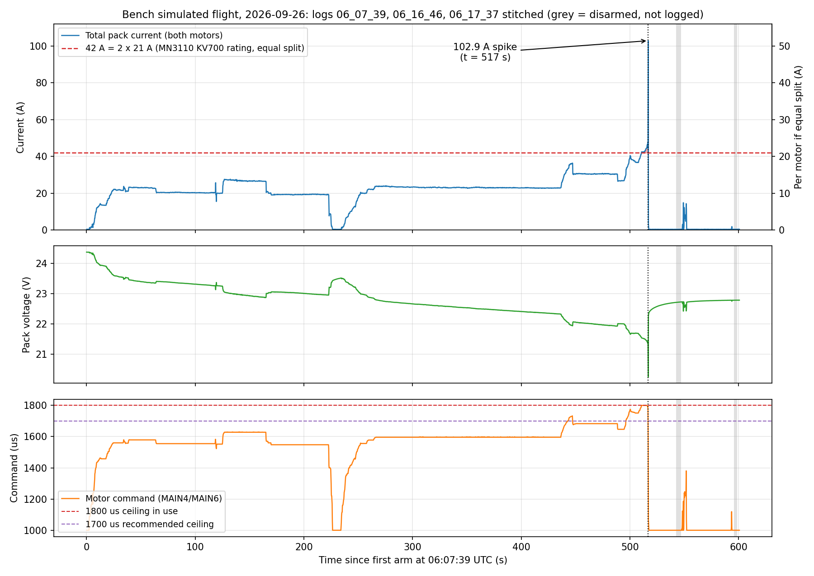
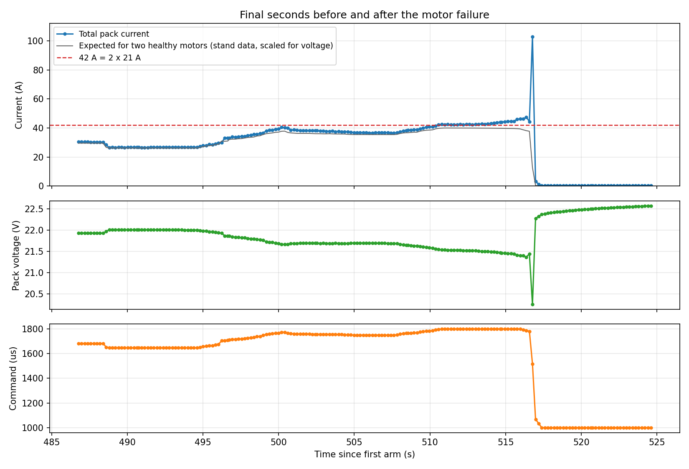
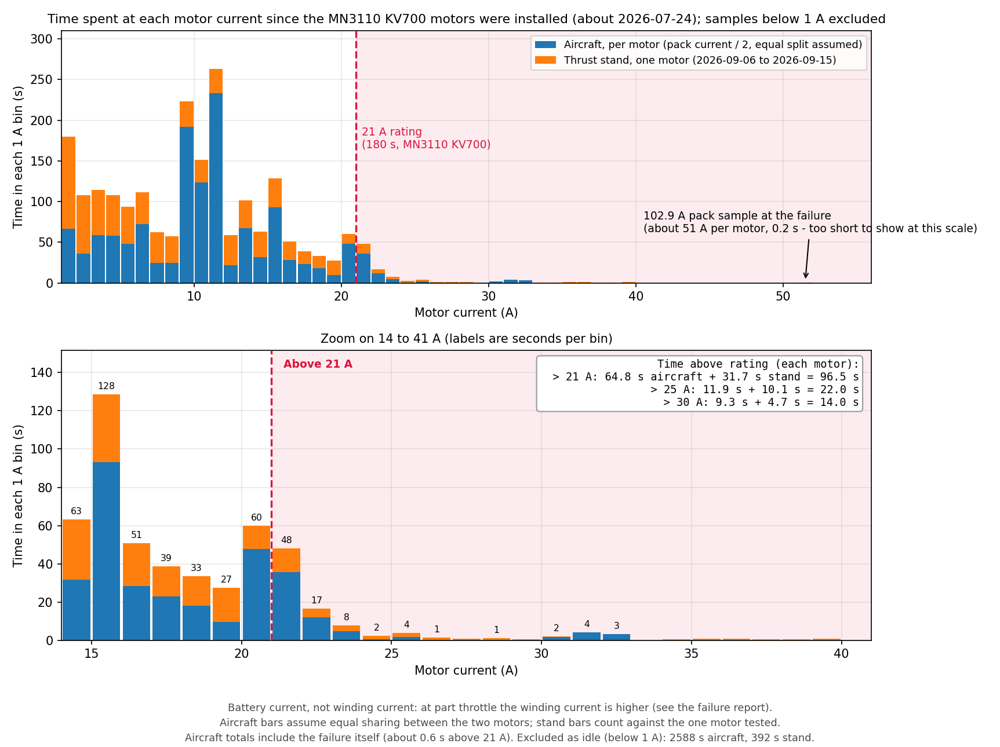

# Test Report - Bench Simulated Flight and Left Motor Failure

| | |
|---|---|
| **Date** | 2026-09-26 (logs timestamped 06:07 to 06:17 UTC) |
| **Location** | Bench (propellers fitted; the propeller model is not recorded - the current matches the APC 12x6" thrust-stand curve within a few percent) |
| **Attendees** | Julian Williams |
| **Purpose** | Run a bench simulated flight on the custom Li-ion battery to test the pack's capacity and confirm the motors could sustain a flight-like load |

## Summary

During the bench simulated flight the left-hand motor burned out at about 516 s into the main log. The flight controller logs show the total pack current stayed within the two-motor equivalent of the MN3110 KV700's 21 A continuous rating for all but about 6 seconds of the 516 s run, so a sustained overcurrent is not supported by the data. The failure instead looks like an electrical fault in the left drive (motor winding or ESC): about 2.5 seconds after the pilot reached the full-throttle command, current began rising at a fixed command, then a single sample of 102.9 A was logged as the throttle was being pulled back. After the failure the system draws 2 to 6 times the current expected for two healthy motors. The failed left motor smoked and melted its 3D-printed PETG mount, and the right-hand side appears fine (per Julian). The capacity test was not completed.

## Logs and Stitching

The last power-up of the flight controller (about 05:48 UTC) was continuous through the following logs, so they stitch directly on the flight controller's boot clock. Each log covers one armed period; disarmed time between logs is not logged.

| Log | Boot time (s) | Duration (s) | Peak current (A) | Notes |
|---|---|---|---|---|
| `06_07_39` | 1133 to 1676 | 543 | 102.9 | Main simulated flight; contains the failure at 516.8 s |
| `06_16_46` | 1680 to 1729 | 49 | 14.8 | Started 4.3 s after `06_07_39` ended - Julian checking the motors after the left motor smoked and failed |
| `06_17_37` | 1732 to 1734 | 2 | 0.4 | Idle |

Earlier logs from the same power-up (`05_53_04`, 286 s, peak 45.2 A, and three short idle logs) are a separate earlier run about 10 minutes before. The whole day's 25 logs are in `G:\log\2026-09-26` on the flight controller's SD card.

## Configuration In Effect (from the parameters recorded at the start of each log)

| Parameter | Value |
|---|---|
| `PWM_MAIN_MAX4` / `MAX6` | 1800 (the recommended ~1700 had **not** been applied) |
| `COM_DISARM_LAND` | -1 (from `03_54_25` onward) |
| `BAT1_V_EMPTY` | 3.2 (from `05_53_04` onward; 3.6 in earlier logs) |
| `WEIGHT_BASE` / `WEIGHT_GROSS` | 3.8 / 3.8 (from `05_53_04` onward) |
| `COM_LOW_BAT_ACT` | 0 (Warning only) |
| `BAT1_V_CHARGED` / `BAT1_R_INTERNAL` / `BAT1_CAPACITY` | 4.05 / -1 / -1 |

## Findings

**Was more than 21 A supplied continuously?** Not on the measured totals. Only the total pack current is measured (one shunt for both motors), so the figures below assume the two motors share equally.

| Measure (before the fault, 516 s of `06_07_39`) | Result |
|---|---|
| Mean total current | 22.5 A (11.2 A per motor) |
| Time above 42 A total (21 A per motor) | 5.8 s (longest single stretch 5.6 s), all at the 1800 us command |
| Time above 44 A / 46 A total | 1.7 s / 0.4 s |
| Highest pre-fault total current | 47.6 A (23.8 A per motor) |
| Highest rolling 60 s / 120 s / 180 s RMS current per motor | 16.6 A / 14.9 A / 13.9 A |
| Squared-current-time in the final 180 s | 34,600 A^2 s, 44% of the 79,400 A^2 s that 21 A for 180 s represents |

To exceed 21 A RMS over the worst 60 s the left motor would have needed about 63% of the total current, and about 75% over 180 s. Before the fault the measured current matched what two healthy motors should draw at each command (measured/expected 1.02 at 1500 to 1700 us, 1.05 at 1700 to 1795 us, using the thrust-stand data scaled for supply voltage), which is consistent with an even split.

**Sequence at the end of the run (times in the main log):**

| Time (s) | Event |
|---|---|
| 508 to 511 | Throttle stick raised to 100%, so the command reached the 1800 us ceiling; total current 42.4 A at 21.5 V |
| 511 to 513.5 | Stick held at 100%; steady 42.4 to 42.7 A at a fixed 1800 us |
| 513.5 to 516.0 | **Current climbs from 42.7 A to 46.4 A at a fixed 1800 us**, with the pack voltage nearly unchanged (21.50 to 21.40 V) - a load increase that the command does not explain |
| 516.0 to 516.4 | Stick eased slightly (98.6%, then 96.2%; command 1793 to 1788 us) while current rose to 47.6 A |
| 516.6 | Stick pulled to about 34% throttle within 0.2 s |
| 516.8 | **One sample of 102.9 A** at 20.25 V, with the command already down at 1517 us |
| 517.0 to 517.4 | Current collapses to 3.2 A, then 0.3 to 0.4 A at idle; stick at minimum by 517.4 s; disarmed at 541.6 s |

The 102.9 A spike is more than double the 44 to 48 A that had been flowing 0.2 to 0.4 s earlier, at a moment when the command was falling. The pack voltage drop across the spike (1.46 V for 68 A, about 21.5 mOhm) matches the charger-measured pack resistance, so the pack and current sensor behaved consistently. Battery telemetry is logged at only 4.9 Hz, so the true peak may have been higher and shorter.

**Other signals checked around the failure:**

- **Flight mode:** Acro for the whole run, so the motor command is the throttle stick passed straight through; the 1800 us ceiling was a held-full stick, not an automatic controller.
- **Vibration:** the flight controller's accelerometer and gyro vibration metrics stayed level through the last seconds (accelerometer metric about 2.0 at full throttle, 2.07, then 2.00, against 1.9 to 2.1 in the preceding minute) - no growth before the failure, though the metrics are coarse (about 1 Hz).
- **Flight controller power:** the 5 V rail stayed at 4.86 to 5.05 V through the event and the flight controller never restarted.
- **Failsafes:** none raised, and no messages were logged between 490 s and the disarm. PX4's motor-failure detector needs ESC telemetry, which this system does not have.

**After the failure (`06_16_46`):** at commands of 1114 to 1381 us the measured current averaged 6.7 A against about 2.0 A expected for two healthy motors (a ratio of 3.3); for example 12.2 A at 1239 us and 14.3 A at 1381 us. Idle current at 1000 us is normal (0.35 A). The drive is still drawing abnormal current whenever it is driven.

**Earlier overcurrent exposure.** Across today's logs the total current exceeded 42 A for about 40 s in total (individual excursions of 3 to 11 s, all at the 1800 us ceiling; the failing run's 6.4 s was not the longest). The motors also saw brief 60 to 66 A total (about 30 to 33 A per motor) bursts with the 11x7" propellers, logged on 2026-08-18 (65.0 A) and 2026-09-02 (65.9 A). That earlier stress may have weakened the winding insulation. The whole-life tally is in the next section.

**Capacity test.** Not completed: the flight controller counted 4,204 mAh discharged over the whole power-up, from a start of about 24.8 V, against the roughly 12.4 Ah expected. No capacity figure can be derived from this run.

## Time Above Rated Current Since the Motors Were Installed

**Installation date.** Julian gave it as roughly 2026-07-24. The flight logs bracket it. The last log made with the previous motors' configuration (motor range 1100 to 1900 us, peak 19.8 A total at 1900 us) is 2026-07-06, and the 2026-07-10 logs still show that range with the motors barely spun (1.7 A peak). The motor range was changed to 1000 to 2000 us at 06:33 to 06:35 UTC on 2026-07-26, and the first high-current run followed at 06:46 UTC (51.4 A total). There are no logs between 2026-07-10 and 2026-07-26, so the tally is the same for any start date in that gap. The 2026-08-19 date in earlier notes is when the change was reported with a parameter export, not the install date: the 2026-08-18 log already shows the MN3110 current draw (42.5 A total at 1800 us, matching the stand's 21.3 A at 1780 us for the 11x7").

**Method.** Every log on the SD card (322 logs, 2023-07 to 2026-09) was scanned for `battery_status` current. The time each sample spent above 42 A total (21 A per motor if the two share equally) was summed, capping each sample's duration at 0.5 s. Folder dates are UTC; every relevant log falls on the same local date at UTC+10. The 2023 and 2024 logs are from when the flight controller was on a multicopter and are not relevant, and the fixed-wing logs start on 2026-05-14.

| Date (UTC) | Time above 42 A total | Peak total current | Note |
|---|---|---|---|
| 2026-07-26 | 1.6 s | 51.4 A | Motor command at 2000 us |
| 2026-08-18 | 9.4 s | 65.0 A | 5.2 s above 60 A (30 A per motor) |
| 2026-09-02 | 14.1 s | 65.9 A | Bench thrust test; 3.9 s above 60 A |
| 2026-09-26 | 39.7 s | 47.2 A before the fault | Ceiling 1800 us; about 0.6 s of this is the failure itself |
| Aircraft total | **64.8 s** | | |

**Thrust stand (2026-09-06 to 2026-09-15).** Julian confirmed the RCbenchmark runs in `MN3110_12_6` and `MN3110_11_7` used the motors installed in the aircraft, one motor on the stand at a time. Time with the stand current above 21 A: 29.1 s on the 12x6" (2026-09-15; peak 40.0 A, 4.4 s of it above 30 A) and 2.6 s on the 11x7" (2026-09-10; peak 21.6 A), 31.7 s in total. The folder holds 13 CSV files (9 for the 12x6", 4 for the 11x7"), all included. The 11x7" `combined_continuous` file repeats the three 11x7" runs and is excluded. Which motor was on the stand is not recorded.

**Total since installation:** about 96.5 s above 21 A per motor (64.8 s in the aircraft plus 31.7 s on the stand, the stand time counting against the one motor tested). Above 25 A per motor: about 22 s (11.7 s aircraft, 10.1 s stand). Above 30 A per motor: about 14 s (9.1 s aircraft, 4.7 s stand).

**Lower thresholds.** Battery current understates the current in the motor windings at part throttle (the ESC steps the voltage down, so winding current is higher than battery current; estimate in `context/project-notes.md`, 2026-09-27). As a sensitivity, total pack current above 28 A (14 A per motor) totals about 317 s since installation and above 20 A (10 A per motor) about 760 s, of which about 402 s was the failing run itself. These are aircraft-only figures and exclude the stand.

Limits of the tally: equal split between the motors is assumed (only total current is logged); sampling is about 5 Hz, so short peaks are undercounted; the current sensor calibration was not independently checked; the battery differs between runs (the custom Li-ion pack from 2026-09-26); and any run made without logging is not counted.

## What the Evidence Supports

- **Supported:** a fault developed in one of the two drives while the throttle was held at 100% for about 5 s; it was not a sustained overcurrent by the measured totals.
- **Consistent with it:** a winding or insulation breakdown in the motor, or a failure in the ESC's power stage. Either can draw a large battery-side current while the ESC is driving and open up afterwards, which matches the single 102.9 A sample followed by an immediate collapse. The logs cannot separate the two.
- **Not supported:** a mechanical cause showing as growing vibration (none seen, at coarse resolution), a flight controller or power fault (5 V and the processor were normal), or a pack fault (the voltage drop across the spike matches the pack's measured resistance).
- **The melted PETG mount points at the motor:** the failed left motor melted the PETG it is mounted on (per Julian). PETG typically softens at roughly 70 to 80 degrees C, and visibly melting it needs the mount to have been far hotter than a healthy motor at 21 A would make it, so the motor was the hot component. That fits a winding fault, but a failed ESC forcing current through the windings would heat the motor just as much, so it does not clear the ESC (next bullet). The logs cannot say whether the heat caused the fault or came from it, or whether it came at the failure or later: `06_16_46` is Julian checking the motors after the left one smoked, and shows the failed drive drawing 12 to 14 A at 1239 to 1381 us for a few seconds, which would have heated the damaged motor further and put abnormal current through the left ESC as well.
- **The ESC is a live candidate:** the ESCs are enclosed in the wing with no airflow (per Julian), and the AIR 40A is a 26 g ESC with no heatsink whose manual gives no airflow requirement (its 40 A and 60 A ratings presumably assume the airflow of a multirotor arm - an assumption). Two mechanisms fit the data: a motor winding short that tripped the ESC's protection, or an ESC power-stage failure that forced current through the motor windings and burned them. Checks that would separate them: the burn pattern on the stator (two phases burned points at forced current; a single coil at an internal short), the winding resistances, and testing the left ESC with a known-good motor on a current-limited supply with the propeller off.
- **ESC protection may explain the collapse:** the AIR 40A manual (`Component datasheets/tmotor-air-40a-esc-manual.pdf`) states the ESC cuts its output when the load suddenly rises to a very high value and only resumes once the throttle returns to neutral. That fits the current falling from 102.9 A to 3.2 A within about 0.2 s. It would suggest the ESC's protection responded to a fault downstream (for example a shorted motor winding), and may have limited the damage, but the spike exceeded the ESC's 60 A 10 s rating, so the ESC still needs checking. The manual also lists ESC timing as a setting (default Intermediate; High raises motor temperature); the timing in use is not recorded.
- **Not known:** which drive failed (both motors always received the identical command, and only total current is logged), the motor's temperature, and the exact shape and duration of the spike (one sample at 4.9 Hz).
- **Margin, which the totals alone can hide:** full stick at the 1800 us ceiling put each motor at its rated maximum with no margin - about 21.2 A and 457 W per motor (101% of 21 A, 98% of 466 W) - rising to about 23.2 A (110%) at 516.0 s and 23.8 A (113%, 508 W) at 516.4 s, for about 6 s in total, if the two shared equally. If the left motor took 55% or 60% of the total, those figures become about 26 A or 29 A at the peak. The rating is for 180 s, so a brief excursion is not enough on its own to explain a failure, and a 9% rise in 2.5 s is faster than ordinary heating changes a motor's current; but running at the limit may have been what tipped a weakened or heat-soaked motor or ESC over. The 1800 us ceiling itself left no margin: it was chosen on 2026-09-02, with the 11x7" propellers, to sit at about 21 A per motor, and with the 12x6" a full pack (about 24 V loaded) would draw roughly 26 A per motor at 1800 us by the stand data.

## Limitations

- Only total current is measured. The share taken by the left motor, and its temperature, are unknown.
- No ESC or motor telemetry was logged, so the logs cannot say whether the motor or the ESC failed first.
- Sampling at 4.9 Hz can miss short current transients.
- The "expected current" comparison depends on the thrust-stand data (APC 12x6", `docs/engineering/test-reports/2026-09-15-mn3110-thrust-stand-characterisation.md`) extrapolated above 1700 us and scaled for voltage; it is a first-order estimate.

## Actions Taken

- None on the aircraft as a result of this analysis. The failed drive should not be powered again until inspected: it draws abnormal current when driven.

## Outstanding

- Inspect the left motor and, separately, its ESC: 102.9 A is well above the AIR 40A's 40A continuous and 60A 10 s ratings, so the ESC may also be damaged. Also check the right-hand motor and ESC, the power distribution board, and the wiring and connectors carrying that current.
- Measure phase-to-phase winding resistance and resistance to the case on both motors, and turn each by hand for roughness. **Attempted 2026-09-27 (Julian):** a multimeter read consistently 24 to 25 ohms phase-to-phase on the failed left motor, and about 24 ohms on the right motor. Both readings are about 260 times the datasheet's 92 mOhm internal resistance, so they are not a measurement of the winding: an ordinary two-wire ohmmeter cannot resolve a resistance this low and instead reads the probe and connector contact resistance (worsened by any oxidation at the bullet connectors). The readings do rule out a dead short (near 0 ohm) and an open winding (infinite/OL) on either motor, and the left and right motors reading close to each other is mildly reassuring against a hard short in the left, but the test cannot confirm winding health, balance, or a partial short or insulation breakdown - the actual check needs a four-wire (Kelvin) milliohm meter for winding resistance and an insulation resistance test (megohmmeter, phase to case) for breakdown, neither of which was available.
- The ESC timing setting is unknown; the manual only allows setting it, not reading it back, so set Intermediate (the default) explicitly whenever the ESCs are recalibrated. Check the right-hand motor's winding resistances and insulation and its PETG mount for softening even though it appears fine - it saw the same run. Motor and ESC temperature have never been measured; add a temperature reading to the next bench run.
- Decide ESC cooling or rating: the ESCs are enclosed in the wing with no airflow (per Julian). For bench runs, consider an inline fuse or breaker (around 80 to 100 A, bench only - a fuse tripping in flight would remove all power) or a current-limited supply, because the pack has no BMS and this failure produced a short-circuit-like current.
- PETG mount: Julian regards the melting as a consequence of the failure, not a cause. Whether the mount temperature in normal operation approaches PETG's softening point (typically roughly 70 to 80 degrees C) has not been measured; record it in the next bench run and revisit the material only if it does.
- Decide the replacement motor (same MN3110 KV700 or a different motor) - tracked as PROP-11.
- Apply the ~1700 us motor ceiling before any further power-on testing (PROP-08). At 1700 us the total current in this run was about 31 to 33 A, or roughly 16 A per motor.
- Repeat the capacity test once the drive is repaired.

Full detail and task tracking: [`docs/project/build-checklist.md`](../../project/build-checklist.md) PROP-08, PROP-11. Provenance and decision history: [`context/project-notes.md`](../../../context/project-notes.md).
