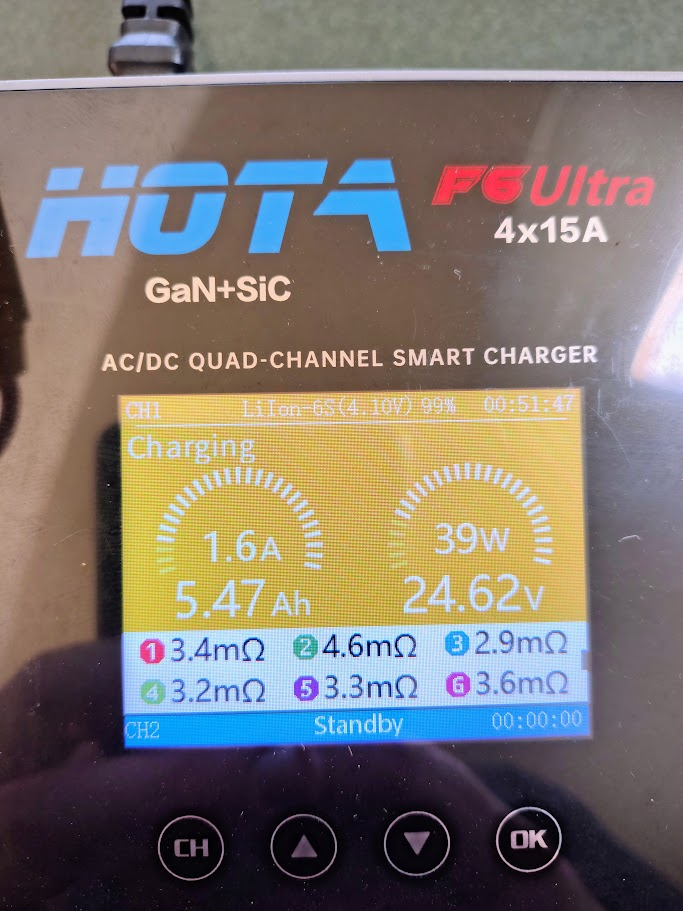

# Test Report - Custom Li-ion Battery Build and Internal Resistance

| | |
|---|---|
| **Date** | 2026-09-26 |
| **Location** | Bench (charging) |
| **Attendees** | Julian Williams |
| **Purpose** | Record the custom flight battery's configuration and the per-group internal resistance measured by the charger, ahead of the capacity test |

## Summary

Julian built a custom 6S4P Li-ion flight battery from 24 NCR20700A cells to replace the Turnigy 6S LiPo. It places the centre of gravity correctly without ballast (`docs/project/build-checklist.md` AF-01) and is retained by a strap and underside velcro (AF-02). It has no battery management system (BMS). A charger internal-resistance reading gave a total pack resistance of about 21 mOhm, with one series group (group 2) noticeably higher than the rest. The capacity test has not been run yet.

## Pack Configuration

| Item | Detail |
|---|---|
| Configuration | 6S4P (six series groups of four parallel cells, 24 cells) |
| Cell | NCR20700A (Panasonic/Sanyo part number; cell authenticity not verified) |
| Protection | No BMS - no cell-level low-voltage cut-off, overcurrent, or short-circuit protection |
| Retention | Single strap plus velcro on the underside (AF-02) |
| Charger | HOTA F6 Ultra 4x15A, "LiIon-6S (4.10V)" profile - a charge target of 4.10 V per cell (24.6V), below the cell's 4.20V standard charge voltage |
| Pack mass | TBD (not weighed) |
| Measured capacity | TBD (capacity test pending) |

Cell reference values from the manufacturer datasheet (`Component datasheets/panasonic-ncr20700a-cell-datasheet.pdf`; the datasheet states its values are not guaranteed):

| Characteristic | Value |
|---|---|
| Rated capacity | 3100 mAh (minimum 3150 mAh, typical 3300 mAh) |
| Nominal voltage | 3.6V |
| Standard charge | CC-CV, 4.20V, 2200 mA |
| Discharge end voltage used on the datasheet curves | 2.5V |
| Discharge temperature | -20 to +60 degrees C |
| Weight | 60.0g maximum |

For four cells in parallel the rated capacity is about 12.4 Ah (12.6 Ah minimum, 13.2 Ah typical), and the 24 cells alone weigh up to 1.44 kg.

## Internal Resistance

Charger-measured resistance per series group (each reading covers four cells in parallel):

| Group | Resistance (mOhm) |
|---|---|
| 1 | 3.4 |
| 2 | 4.6 |
| 3 | 2.9 |
| 4 | 3.2 |
| 5 | 3.3 |
| 6 | 3.6 |
| **Total** | **21.0** (mean 3.5 per group) |

Charger display at the time of the reading: charging, 1.6A, 39W, 24.62V, 5.47 Ah charged, 99%, 51 minutes 47 seconds elapsed.

## Findings

- **Voltage sag.** At 21.0 mOhm the pack drops about 0.8V at 38A (two motors at the 1700 us ceiling, `docs/engineering/test-reports/2026-09-15-mn3110-thrust-stand-characterisation.md`), 0.9V at 42A, and 1.4V at 65A (the brief full-throttle peak seen on 2026-08-31). The pack dissipates roughly 30W as heat at 38A. The thrust-stand supply sagged about 0.05 V/A, so this pack is stiffer.
- **The thrust-stand ceiling should carry over.** Charged to 24.6V and loaded at about 38A, the pack should sit near 23.8V, within about 1% of the 24.0V the stand recorded at 1700 us. To a first-order estimate that keeps the current at about 19A per motor.
- **Group 2 is the outlier.** At 4.6 mOhm it is about 40% above the mean of the other five groups (3.3 mOhm) and 59% above the best group (2.9 mOhm). A group where one of the four cells is not contributing (for example a poor spot weld or strip) would read about 33% high, so this is consistent with that, though it could equally be one higher-resistance cell. The effect on load voltage is small (about 44 to 68 mV between group 2 and the mean or best group at 40A), but a weak connection can heat under load.
- **Charge target.** Charging to 4.10 V per cell means the capacity test will read below the datasheet figure even for healthy cells, since the last 0.1V holds a meaningful share of the capacity.
- **5.47 Ah is not a capacity measurement.** The starting state of charge is unknown. It is consistent with a pack that started about half charged, but the capacity test will settle it.

## Limitations

- The resistance is a charger estimate taken during charging (1.6A, near the end of the constant-voltage stage), not a measurement under flight load. Its accuracy is unknown.
- Each reading is per series group of four parallel cells, so it does not show whether the four cells within a group share equally.
- With no BMS, nothing protects the pack from over-discharge, and PX4 only sees the total pack voltage. The weakest group can reach the cell's 2.5V floor before the total voltage suggests it should.

## Actions Taken

- None on the aircraft. The photo was moved to `docs/assets/` and the cell datasheet added to `Component datasheets/`.

## Outstanding

- Run the capacity test, logging per-group voltages (especially group 2) through to the end of discharge, and record the measured capacity here.
- Weigh the pack and record it, then the all-up weight (AF-01 context, PROP-10, CTL-09).
- Check the group 2 connections (weld or strip) and re-measure its resistance at rest.
- Review the PX4 battery parameters for the Li-ion pack - see `context/open-items.md`. `BAT1_R_INTERNAL` is a per-cell figure in PX4, so the measured mean (about 3.5 mOhm per series group) is the comparable value.
- Decide the in-flight voltage limit for a pack with no BMS and how it is checked before flight.

Full detail and task tracking: [`docs/project/build-checklist.md`](../../project/build-checklist.md) AF-01, AF-02. Provenance and decision history: [`context/project-notes.md`](../../../context/project-notes.md).

Sources: [Panasonic NCR20700A datasheet](https://www.dnkpower.com/wp-content/uploads/2019/02/Panasonic_NCR20700A-Specification-Datasheet.pdf), [PX4 battery estimation tuning](https://docs.px4.io/main/en/config/battery).
