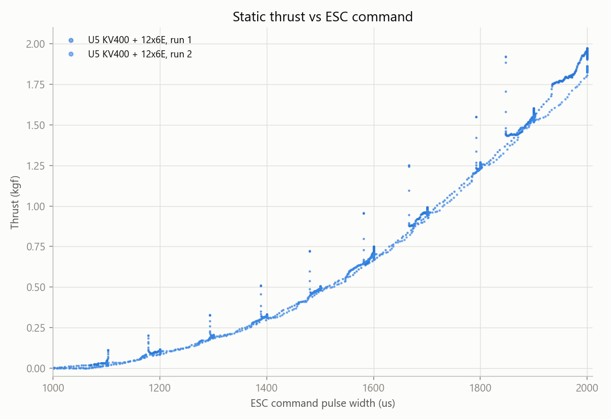
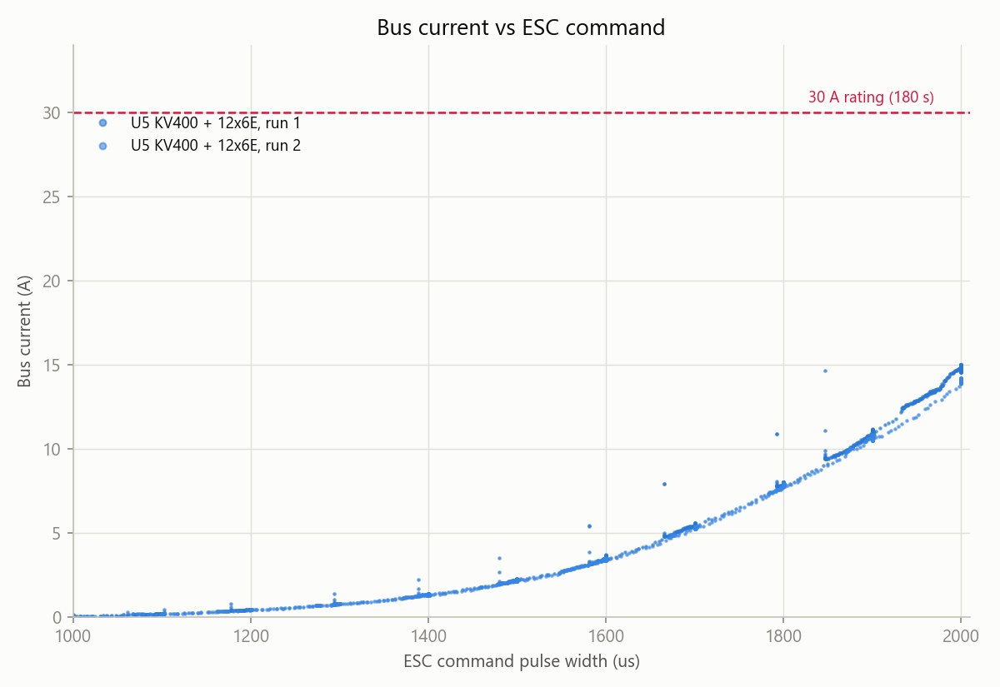
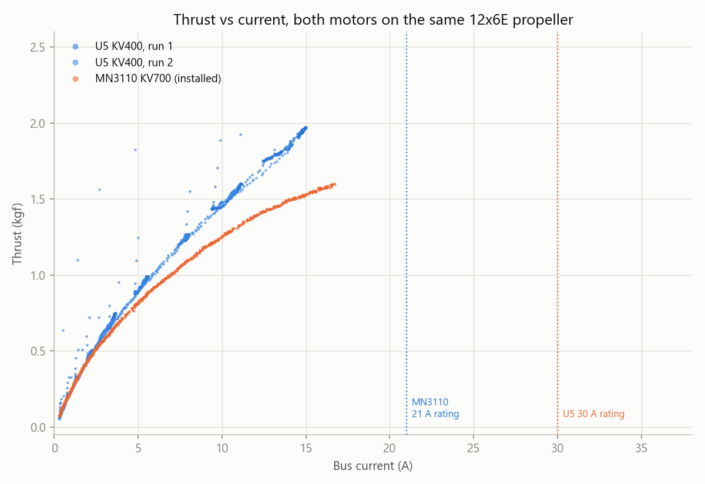

# Test Report - U5 KV400 Thrust Stand Characterisation (Initial)

| | |
|---|---|
| **Date** | 2026-09-30 |
| **Location** | RCbenchmark Series 1520 thrust stand (re-borrowed) |
| **Attendees** | Julian Williams |
| **Purpose** | Initial characterisation of thrust, current, power, and rotor speed of the T-Motor U5 KV400 with the 12x6E propeller, as a candidate replacement for the failed MN3110 KV700 (PROP-11) |
| **Status** | Initial sweep data only. Not a sustained-duration or temperature test; PROP-11's 180 s bench-run acceptance criterion is not yet met |

## Summary

The U5 KV400 was run on the thrust stand with the 12x6E propeller across two runs, sweeping the ESC command from 1000 to 2000 us and back down, with brief holds at several throttle levels. No cutout occurred (the stand's earlier cutout with the MN3110 was near 500 W; the U5 reached only about 325 to 350 W at full throttle). Full-throttle static thrust was 1.84 to 1.94 kgf at 14.0 to 14.7 A, well under the motor's 30 A continuous rating. Compared with the installed MN3110 KV700 on the same propeller, the U5 gives more thrust for the same current at every point measured.

## Test Setup

| Item | Detail |
|---|---|
| Stand | RCbenchmark Series 1520 |
| Motor | T-Motor U5 KV400 |
| Propeller | 12x6E (as marked; see `docs/engineering/analysis/powertrain-performance-model.md` on its likely Gemfan-copy origin) |
| ESC on the stand | The right-hand MN3110's AIR 40A ESC (not the ESC from the failed left drive) |
| Supply | Not recorded (battery or bench supply); resting voltage 23.7 to 24.5 V, sagging to 23.0 to 23.7 V under load |
| Method | ESC command swept from 1000 us to 2000 us and back down, with brief holds (about 10 to 25 s) at intermediate levels. Not a sustained hold at any one level |
| Logged | Thrust, voltage, current, electrical power, motor electrical speed (rotor speed - see below), optical speed (zero throughout, as with the earlier MN3110 runs) |
| Not recorded | Motor or ESC temperature, propeller brand confirmation |

| Run (log file) | Duration | Resting voltage (V) | Full-throttle voltage (V) | Time at or above 1980 us |
|---|---|---|---|---|
| `Log_2026-09-30_104335` | 287 s | 24.46 | 23.7 | 25 s |
| `Log_2026-09-30_105239` | 209 s | 23.69 | 23.0 | 15 s |
| `Log_2026-09-30_112128` | 275 s | (not separately logged) | (not separately logged) | (not separately isolated) |
| `Log_2026-09-30_112918` | 6 s | - | - | Aborted/very short run, excluded from the analysis |
| `Log_2026-09-30_112954` (extended) | 641 s | 24.57 | 23.64 (mean, full-throttle samples) | 2 s (16.6 s at or above 1960 us) |

## Extended Run

A fourth, longer run (`Log_2026-09-30_112954`, 641 s) swept the ESC command slowly from 1000 to 2000 us and back down (about 5.5 us/s each way), rather than the faster sweeps and holds of the first two runs. It gives about 490 samples at or near full throttle and confirms the earlier calibration with more data: 1.92 kgf at 14.6 A at full throttle, thrust factor 0.98 and power factor 1.01 essentially unchanged when the four runs are combined (rms current error 3.2% across 12 bins). No anomalies, drift, or asymmetry between the up and down sweep were observed. It does not constitute the sustained, fixed-throttle 180 s hold PROP-11 asks for (see Outstanding).

**Condition and heat, informal:** Julian reports the U5 units appear in good condition, and were indistinguishable from room temperature to the touch after these tests, including the full-throttle exposure. This is a qualitative, hand-touch observation, not a logged measurement, and does not by itself satisfy PROP-11's temperature-logging criterion.

## Findings

**Full-throttle point (mean over the time at or above 1980 us):**

| Run | Thrust | Current | Voltage | Power | Rotor speed |
|---|---|---|---|---|---|
| 1 | 1.94 kgf | 14.7 A | 23.7 V | 350 W | 8016 rpm |
| 2 | 1.84 kgf | 14.0 A | 23.1 V | 323 W | 7827 rpm |

Both runs are well under the U5's 30 A continuous rating (47 to 49%) and comfortably below the stand's approximately 500 W cutout level that limited the earlier MN3110 12x6E runs.

**Rotor speed channel.** As with the MN3110 runs (`docs/engineering/test-reports/2026-09-15-mn3110-thrust-stand-characterisation.md`), the `Motor Electrical Speed (RPM)` column reads spurious values below about 1500 to 1550 us and usable rotor speed above it. Checked against the rotor speed implied by the measured thrust and the propeller's static thrust coefficient, the two agree to within about 4% across the bins from 1560 to 2000 us (mean ratio 1.01, sd 0.02), so the channel is usable for this motor and run.

**Comparison with the installed MN3110 KV700, same propeller:**

At every current level measured, the U5 gives more thrust than the MN3110 on the same propeller: for example, about 1.3 kgf at 10 A for the U5 against about 0.95 kgf for the MN3110. This follows from the U5's lower KV (400 against 700), which gives more torque per amp, and is consistent with the powertrain model's structural expectation (`docs/engineering/analysis/powertrain-performance-model.md`), not a new finding from this data alone.

## Powertrain Model Update

The U5-specific propeller scale factors were fitted the same way as for the MN3110 (`docs/engineering/analysis/powertrain-model/calibrate_12x6e.py`, extended for this dataset): thrust factor 0.98 and power factor 1.01, against 0.99 and 1.22 for the MN3110 run on 2026-09-15. The power factor is markedly different between the two motors' tests on nominally the same propeller model, which most likely reflects unit-to-unit variation between the (probably copied, see the analysis document) 12x6E props, rather than a property of the propeller pattern itself; it could also reflect error in the assumed motor parameters (resistance, idle current) for one or both motors, which cannot be separated from static data alone.

With this calibration, at 24.0 V:

| | Static (full throttle) | 10 m/s | 15 m/s | 20 m/s |
|---|---|---|---|---|
| Total thrust (two motors) | 3.5 to 3.7 kgf | 3.05 kgf | 2.49 kgf | 1.87 kgf |
| Drag (3.8 kg) | - | 0.52 kgf | 0.51 kgf | 0.70 kgf |
| Margin | - | 5.8 times | 4.8 to 5.0 times | 2.6 to 2.7 times |
| Static thrust-to-weight | 0.95 (3.95 kg) / 0.90 (4.14 kg design mass) | - | - | - |

At a mid-discharge pack (22.2 V): static thrust-to-weight 0.83, and total thrust margin 4.9 times at 10 m/s and 2.1 times at 20 m/s.

Cruise power at 24.0 V: about 113 W at 13 m/s, 132 W at 15 m/s, 222 W at 20 m/s, all at 13 to 19% of the rated winding current - the lowest thermal stress of the candidate motors by a wide margin. Full working and the recalibrated model outputs are in `docs/engineering/analysis/powertrain-model/` (the `f=0.9` sensitivity case from the earlier, unmeasured estimate is superseded for the U5 by this direct calibration; battery voltage remains a live sensitivity and is retained).

## What This Does and Does Not Show

**Shown:** static thrust and current across the throttle range; that the U5 stays well under its current rating even at full throttle with the 12x6E; that it gives more thrust per amp than the installed MN3110 on the same propeller; a recalibrated flight-speed extrapolation with a large margin at typical cruise speeds.

**Not shown:** sustained thermal behaviour (no run held at a fixed high throttle for close to the 180 s rating, and no temperature was measured - PROP-11's acceptance criterion is still open), the condition of the specific U5 units intended for the aircraft (no insulation, winding-resistance, or hand-spin check recorded here), ESC behaviour with this motor, or any in-aircraft or flight measurement.

## Outstanding

- Run a sustained test at a chosen throttle ceiling for at least 180 s with motor and ESC temperature logged (PROP-11 acceptance criterion). Julian plans this once a thermal camera is available.
- Test the suspect (failed left drive's) ESC directly - Julian plans this next. All U5 data so far used the right-hand MN3110's ESC, which is not known to be faulty, so it says nothing about the left ESC's condition.
- Check the U5 units' condition formally (insulation to the case, winding-resistance balance) - the hand-spin and visual check and the informal heat check are done and reported good, but not yet the electrical checks.
- Confirm the propeller's brand (APC or a copy) if possible, to sharpen the calibration (`context/open-items.md`).
- Weigh the U5 pair as fitted, with leads, against the installed MN3110 pair.
- Carry this calibration into a restrained in-aircraft test once the motors are installed.
