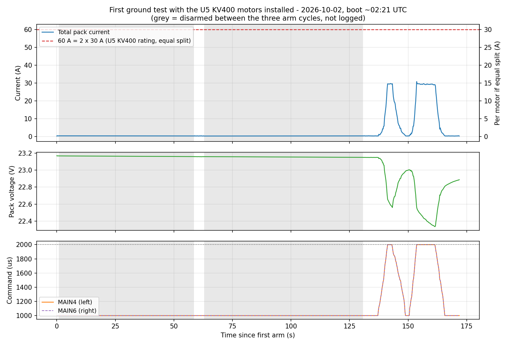

# Test Report - First Ground Test With the U5 KV400 Motors Installed

| | |
|---|---|
| **Date** | 2026-10-02 |
| **Location** | Aircraft, on the bench (not the thrust stand) |
| **Attendees** | Julian Williams |
| **Purpose** | Quick spin-up check of both motors after the T-Motor U5 KV400 / AIR 40A install (PROP-11), and confirmation of the `PWM_MAIN_MAX4`/`MAX6` = 2000 and `WEIGHT_BASE`/`WEIGHT_GROSS` = 4.0 parameter changes (PROP-08) |
| **Status** | Clean result. This was a brief spin-up, not a sustained hold - see Limitations |

## Summary

Three arm cycles were logged on one boot (`G:\log\2026-10-02`, boot starting about 02:21 UTC): two brief arms with no throttle applied (`02_21_21.ulg`, `02_22_20.ulg`), then a 41 s run with two throttle ramps to full stick (`02_23_32.ulg`). Peak total pack current was 30.9 A at full throttle (2000 us), about 15.5 A per motor if the two share equally - roughly half of the U5's 30 A rating. `MAIN4` and `MAIN6` commands matched exactly throughout. No fault, failsafe, or overcurrent flag was recorded; the PX4 failure detector read clear for the whole log.

## Findings

**Parameters confirmed from the log** (the log's embedded parameter set at boot, equivalent to an export for this purpose):

| Parameter | Value |
|---|---|
| `PWM_MAIN_MAX4` / `MAX6` | 2000 (raised back from 1800, per PROP-08) |
| `WEIGHT_BASE` / `WEIGHT_GROSS` | 4.0 (updated for the U5 swap) |
| `COM_DISARM_LAND` | -1 |
| `BAT1_N_CELLS` | 6 |

**Current and voltage.** Full-throttle current was 29.4 to 30.9 A total across the two throttle ramps (46 samples at the 2000 us bin in the second ramp), pack voltage sagging from about 23.15 V to 22.45-22.98 V under load. This is close to the thrust-stand result for the same motor and propeller (14.0 to 16.9 A per motor across the 2026-09-30 stand runs); the slightly lower current here is consistent with the lower pack voltage at the time of this test (about 22.5-23 V against the stand's 23-24 V).

**Command symmetry.** `MAIN4` (left) and `MAIN6` (right) commands were identical throughout (max difference 0 us), confirming both motors were driven the same way. Only total pack current is logged, so this does not show whether the two motors drew equal current - the same limitation noted in the 2026-09-26 failure report.

**Other signals checked:** the 5 V servo rail stayed at 4.80 to 5.05 V with no over-current flag (`periph_5v_oc`/`hipower_5v_oc` both clear); the battery and servo power rails read valid throughout; the IMU's vibration metrics (`accel_vibration_metric` max 1.55, `gyro_vibration_metric` max 0.10) showed nothing unusual; PX4's `failure_detector_status` was 0 (clear) for the entire log.

## What This Does and Does Not Show

**Shown:** both motors spin up together and track the commanded throttle; full-throttle current is well under the U5's rating and consistent with the stand data; the `PWM_MAIN_MAX4`/`MAX6` and `WEIGHT_BASE`/`WEIGHT_GROSS` changes took effect; no fault or failsafe triggered.

**Not shown:** sustained thermal behaviour in the airframe (this was two brief ramps, around 10-15 s total above 20 A, not a hold near the rating); the installed ESCs' behaviour under load in their enclosed, airflow-free wing location over time; per-motor current balance; or any in-flight measurement. PROP-08's closure therefore rests on this quick check together with the 2026-09-30 thrust-stand sustained run (`docs/engineering/test-reports/2026-09-30-u5-kv400-thrust-stand-characterisation.md`), not a fresh sustained in-aircraft test - as anticipated when that task was revised.

## Outstanding

- Per-motor current and temperature are still not instrumented in the airframe.
- No sustained in-aircraft hold near the throttle ceiling has been run.
- The right motor and its ESC have still not been separately stand tested.
