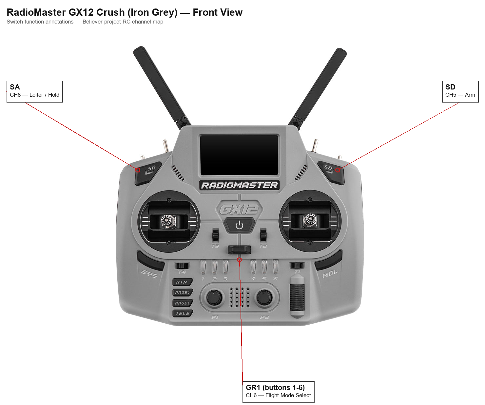
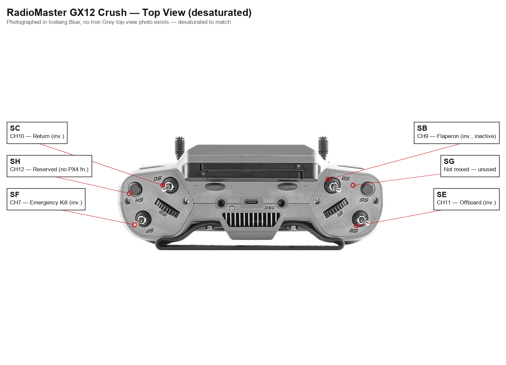
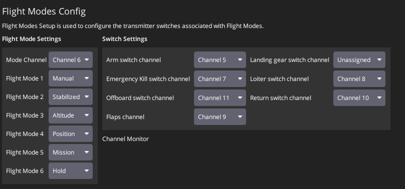

# Believer Flight Manual

Operating manual for the Believer fixed-wing UAV. For wiring/pinout/parameter detail, see [ICD.md](ICD.md) and [../params/parameter-change-log.md](../params/parameter-change-log.md).

## 1. Aircraft Summary

V-tail, twin-motor (left/right) fixed wing, two independently-servoed ailerons. Holybro Pixhawk 6X flight controller running PX4. Centre of Gravity: 15mm aft of the front wing spar carbon rod centerline (~25% MAC).

## 2. RC Control - Channels & Switches

RC link: Radiomaster GX12 transmitter → DBR4 receiver (ExpressLRS, dual-band 2.4GHz/900MHz), Hybrid switch mode with MAVLink enabled.

| Channel | Function | Notes |
|---|---|---|
| CH1 | Roll | Stick |
| CH2 | Pitch | Stick |
| CH3 | Throttle | Stick |
| CH4 | Yaw | Stick |
| CH5 | Arm | Latching button; disarmed at startup |
| CH6 | GR1 flight-mode selector | Six positions; starts on SW2 |
| CH7 | Emergency kill | Inverted in EdgeTX |
| CH8 | Loiter / Hold | Latching button; overrides GR1-selected mode |
| CH9 | Flaperon control / spare | Inverted in EdgeTX; inactive for maiden flight |
| CH10 | Return | Inverted in EdgeTX |
| CH11 | Offboard | Inverted in EdgeTX |
| CH12 | Spare / future buzzer or payload | Currently unassigned |

For channels 7, 9, 10, 11: inversion is handled in EdgeTX already - do not add a duplicate reversal in PX4 unless QGroundControl shows the active/inactive direction is actually wrong.

## 3. Flight Modes (GR1 Switch Group)

GR1 is a six-button switch group on the GX12 (only one of SW1–SW6 active at a time), mapped to CH6 and used as the main PX4 flight-mode selector.

| GX12 Button | PX4 Mode | Use |
|---|---|---|
| SW1 | Manual | Direct-control backup; avoid for normal launch |
| SW2 | Stabilized | Startup/default and hand-launch mode |
| SW3 | Altitude | Holds altitude; pilot still flies direction |
| SW4 | Position | GPS-assisted track/altitude holding |
| SW5 | Mission | Future autonomous missions only |
| SW6 | Hold | Backup access to Loiter/Hold |

**Hold vs. Loiter:** these are the same PX4 mode - "Hold" is the formal PX4 name, "Loiter" is the older/common name still used in switch labelling. When engaged, the Believer flies a circle around the point where Hold was activated while holding altitude - it cannot stop and hover like a multirotor.

CH8 (Loiter/Hold) is a separate switch that overrides whatever mode GR1 has selected and commands Hold directly.

## 4. Flaperons

The Believer has two ailerons, each on its own servo, rather than separate dedicated flap surfaces. This makes it possible to configure flaperons later: a normal roll command moves the ailerons oppositely, while a flap command moves both ailerons down together; PX4 combines the two.

**Do not enable flaperons until the aircraft's baseline handling, trim, stall behaviour, and roll authority are known.** When introduced later, start with small deflections and test well above the ground - flaperons can alter pitch trim and reduce roll authority. CH9 (flaperon control) stays inactive/disabled for the maiden flight and until this testing has been done.

## 5. Pre-Flight Safety State

Intended safe startup condition, to be verified before every flight:

| Channel | State |
|---|---|
| CH5 (Arm) | Disarmed |
| CH6 (Flight mode) | SW2 selected: Stabilized |
| CH7 (Kill) | Inactive |
| CH8 (Loiter) | Inactive |
| CH9 (Flaperons) | Up / disabled |
| CH10 (Return) | Inactive |
| CH11 (Offboard) | Inactive |

## 6. Pre-Flight Checklist

1. Remove airframe components from the carry box and inspect for damage incurred in transport.
2. Assemble the airframe, ensuring all connections are firmly engaged.
3. Reinspect the assembled airframe for damage.
4. Install the 900 MHz antennas to the external antenna ports; ensure they are correctly torqued and oriented to prevent damage.
5. Install the M8N GPS in its mount and torque to secure.
6. Connect the M8N GPS to the GPS 1 port on the Pixhawk flight computer.
7. Power on the GX12 transmitter and confirm the throttle is at the minimum position and the kill switch is engaged.
8. Install the battery using the supplied straps and verify the centre of gravity is correct. Do not connect the battery to the power distribution board at this stage.
9. Connect the RFD900 ground station module to a laptop running QGroundControl.
10. Connect the battery to the power distribution board and establish a connection with QGroundControl.
11. Perform any flight computer calibration steps required.
12. Confirm QGroundControl reports no warnings.
13. Confirm sufficient battery capacity remains for the planned flight.
14. With propellers removed, arm the vehicle in Manual mode.
15. Confirm all flight control surfaces are correctly trimmed and respond appropriately to control inputs: verify correct direction of movement, full and unrestricted travel across the entire stick range, and that all travel limits are set correctly.
16. Switch to Stabilized mode and confirm all flight control surfaces respond appropriately to changes in aircraft attitude.
17. Confirm the motors rotate in the correct direction. Viewed from behind the aircraft looking forward, the left-hand motor must rotate anticlockwise and the right-hand motor must rotate clockwise (see [assets/motor-rotation-direction.png](assets/motor-rotation-direction.png)).
18. Confirm the aircraft can be switched into all flight modes via the GR1 selector (see [assets/gx12-front-switches.png](assets/gx12-front-switches.png) and [assets/gx12-top-switches.png](assets/gx12-top-switches.png)), and that each mode change is mirrored correctly in QGroundControl (see [assets/flight-modes-config.png](assets/flight-modes-config.png)).
19. Confirm QGroundControl reacts appropriately to changes in aircraft attitude.
20. Install and torque the propellers.
21. Confirm GPS has acquired a 3D fix with an appropriate HDOP and VDOP.

See also [build-checklist.md](build-checklist.md) for the build, retention, and configuration checklist.
