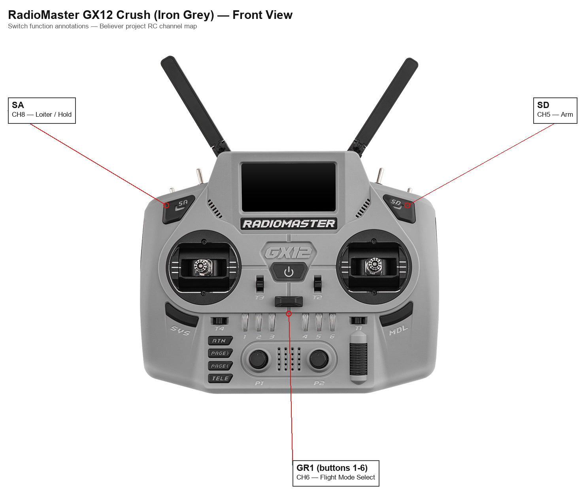
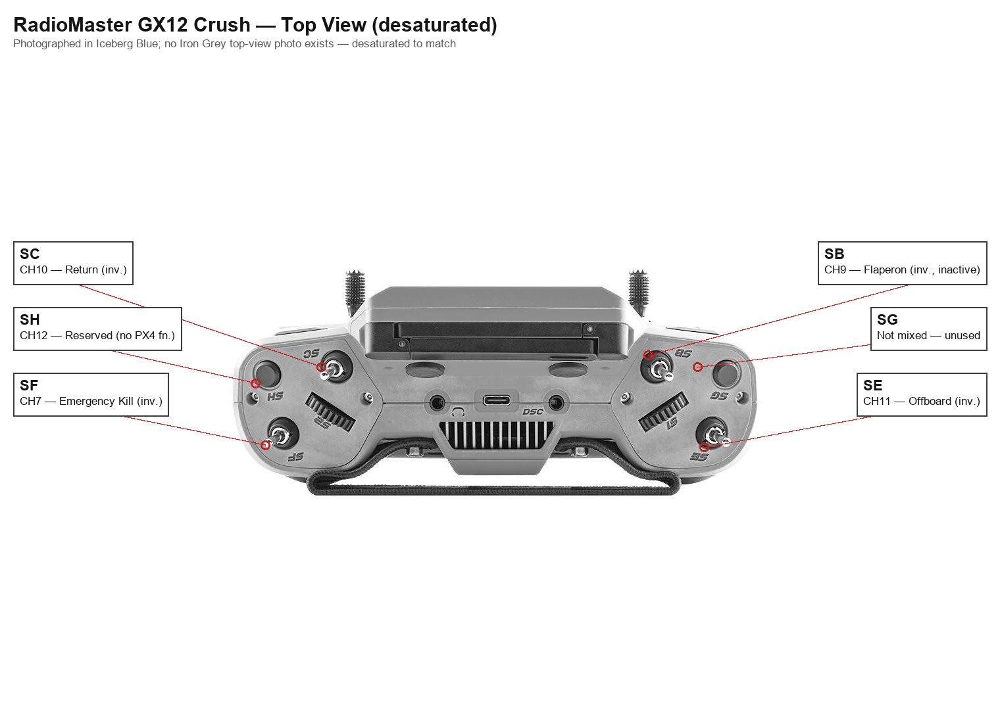
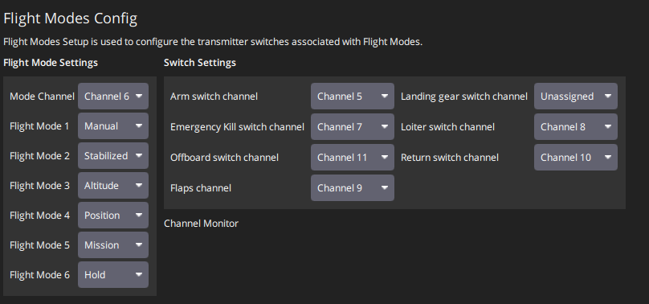

# Believer Flight Manual

Operating manual for the Believer fixed-wing UAV. For wiring/pinout/parameter detail, see [ICD.md](../engineering/ICD.md) and `docs/operations/Pixhawk Parameter Backup/parameter-change-log.md`.

## 1. Aircraft Summary

V-tail, twin-motor (left/right) fixed wing, two independently-servoed ailerons. Holybro Pixhawk 6X flight controller running PX4. Centre of Gravity: 15mm aft of the front wing spar carbon rod centerline (~25% MAC).

## 2. RC Control - Channels & Switches

RC link: Radiomaster GX12 transmitter → DBR4 receiver (ExpressLRS, dual-band 2.4GHz/900MHz), Hybrid switch mode with MAVLink enabled.

| Channel | Function | Notes |
|---|---|---|
| CH1 | Roll | Stick |
| CH2 | Pitch | Stick |
| CH3 | Throttle | Stick |
| CH4 | Yaw | Stick |
| CH5 | Arm | Latching button; disarmed at startup |
| CH6 | GR1 flight-mode selector | Six positions; starts on SW2 |
| CH7 | Emergency kill | Inverted in EdgeTX |
| CH8 | Loiter / Hold | Latching button; overrides GR1-selected mode |
| CH9 | Aileron rate switch | Inverted in EdgeTX. SB drives CH9's radio output unchanged, but PX4 no longer acts on it for Flaperon control - `RC_MAP_FLAPS` cleared to 0 (unassigned), 2026-09-02. SB locally selects the aileron tri-rate curve (100/70/50%, CTL-04) in EdgeTX |
| CH10 | Return | Inverted in EdgeTX |
| CH11 | Elevator rate switch | Inverted in EdgeTX. SE drives CH11's radio output unchanged, but PX4 no longer acts on it for Offboard mode - `RC_MAP_OFFB_SW` cleared to 0 (unassigned), 2026-09-02, resolving the dual-purpose overlap previously noted here. SE locally selects the elevator tri-rate curve (100/70/50%, CTL-04) in EdgeTX |
| CH12 | Spare / future buzzer or payload | Currently unassigned |

For channels 7, 9, 10, 11: inversion is handled in EdgeTX already - do not add a duplicate reversal in PX4 unless QGroundControl shows the active/inactive direction is actually wrong.

## 3. Flight Modes (GR1 Switch Group)

GR1 is a six-button switch group on the GX12 (only one of SW1–SW6 active at a time), mapped to CH6 and used as the main PX4 flight-mode selector.

| GX12 Button | PX4 Mode | Behaviour | Use |
|---|---|---|---|
| SW1 | Manual | Sticks drive the control surfaces directly - no self-levelling | Direct-control backup; avoid for normal launch |
| SW2 | Acro | Sticks command roll/pitch rate directly - no self-levelling, but centring the sticks stops rotation | Startup/default switch position; direct-response flying |
| SW3 | Stabilized | Centring the sticks levels the aircraft; altitude and heading drift freely | Hand-launch mode |
| SW4 | Altitude | As Stabilized, plus altitude is held automatically; heading still drifts | Holds altitude; pilot still flies direction |
| SW5 | Position | As Altitude, plus GPS holds ground track against wind | GPS-assisted track/altitude holding |
| SW6 | Mission | Autonomous; flies a pre-uploaded waypoint mission | Future autonomous missions only |

**GR1 defaults to SW2 (Acro) at startup** - since 2026-08-19 this is no longer Stabilized. Always confirm the active flight mode in QGroundControl and deliberately select Stabilized (SW3) before hand-launch; do not assume the default switch position.

**Hold vs. Loiter:** these are the same PX4 mode - "Hold" is the formal PX4 name, "Loiter" is the older/common name still used in switch labelling. Hold is no longer in the GR1 group (freed 2026-08-19 for Acro, since it duplicated CH8) - it is reachable directly via CH8. When engaged, the Believer flies a circle around the point where Hold was activated while holding altitude - it cannot stop and hover like a multirotor.

CH8 (Loiter/Hold) is a separate switch that overrides whatever mode GR1 has selected and commands Hold directly. CH10 (Return) similarly overrides GR1 and commands the aircraft to climb and fly back to the home position. Offboard mode (hands control to a companion computer) is no longer reachable via any switch as of 2026-09-02 - `RC_MAP_OFFB_SW` was cleared, since SE now serves as the elevator rate switch (CTL-04); Offboard was not in operational use anyway, since the companion computer that would drive it is a future project phase.

For full detail on each mode's behaviour and the PX4 parameters that configure it, see [`flight-modes.md`](../engineering/flight-modes.md).

## 4. Pre-Flight Safety State

Intended safe startup condition, to be verified before every flight:

| Channel | State |
|---|---|
| CH5 (Arm) | Disarmed |
| CH6 (Flight mode) | SW3 selected: Stabilized |
| CH7 (Kill) | Inactive |
| CH8 (Loiter) | Inactive |
| CH9 (Aileron rate) | TBD - confirm intended default/starting rate position |
| CH10 (Return) | Inactive |
| CH11 (Elevator rate) | TBD - confirm intended default/starting rate position |

## 5. Pre-Flight Checklist

### Site and conditions

1. Check the weather forecast. Confirm wind speed, gusts, and visibility are within acceptable limits for the planned flight.
2. Check NOTAMs and confirm the operating area and altitude are clear of airspace restrictions.

### Assembly and inspection

3. Remove airframe components from the carry box and inspect for damage incurred in transport.
4. Assemble the airframe, ensuring all connections are firmly engaged.
5. Reinspect the assembled airframe for damage.
6. Confirm the motor/ESC inspection-bay covers are secured on both sides.
7. Confirm the nacelle fairings are secured.
8. Inspect the pitot tube. Confirm the tube is unobstructed (no insects, moisture, or transport tape covering the inlet) and the tubing to the airspeed sensor is securely connected.
9. Install the 900 MHz antennas to the external antenna ports; ensure they are correctly torqued and oriented to prevent damage.
10. Confirm the DBR4 receiver's antennas are correctly oriented and securely mounted.
11. Install the M8N GPS in its mount and torque to secure.
12. Connect the M8N GPS to the GPS 1 port on the Pixhawk flight computer.

### Power on and ground station

13. Power on the GX12 transmitter and confirm the throttle is at the minimum position and the kill switch is engaged.
14. Install the battery, secure it with the retention strap, and confirm the velcro on the underside of the battery is engaged. Verify the centre of gravity is correct. Do not connect the battery to the power distribution board at this stage.
15. Connect the RFD900 ground station module to a laptop running QGroundControl.
16. Connect the battery to the power distribution board and establish a connection with QGroundControl.
17. Perform any flight computer calibration steps required.
18. Update `SENS_BARO_QNH` to the current ambient barometric pressure reading.
19. Confirm QGroundControl reports no warnings, and that the `COM_DISARM_LAND` parameter reads -1 (auto-disarm on landing is disabled for the maiden flight - see step 45).
20. Confirm `COM_LOW_BAT_ACT` reads 3 (Return at critical battery, Land at emergency battery).
21. Confirm sufficient battery capacity remains for the planned flight.
22. Confirm the home position is set correctly in QGroundControl. This is the point the aircraft will return to on an RTL or failsafe event.
23. Confirm `NAV_RCL_ACT` reads 2 and `NAV_DLL_ACT` reads 2 (RC loss and data-link loss both trigger Return), and that `RTL_TYPE` reads 1 and `RTL_LAND_DELAY` reads -1 (Return goes to the home position confirmed in the previous step and holds there rather than landing automatically).
24. Confirm the geofence is loaded and active in QGroundControl: `GF_ACTION` reads 3 (Return), `GF_MAX_VER_DIST` reads 120 m, and `GF_MAX_HOR_DIST` is set to a radius appropriate for the current flight site rather than 0 (disabled) - see NAV-07.
25. Confirm RC link signal quality (RSSI) is good in QGroundControl before proceeding.

### Ground functional checks (propellers removed)

26. With propellers removed, arm the vehicle in Manual mode.
27. Confirm all flight control surfaces are correctly trimmed and respond appropriately to control inputs in **Manual mode**: verify correct direction of movement, and that each surface reaches its intended safe travel limit at or near full stick, without binding.
28. Switch to Stabilized mode and confirm all flight control surfaces move in the correct direction in response to changes in aircraft attitude. Full, independent surface travel is not expected here; V-tail surfaces may show safe saturation under large combined pitch+yaw attitude changes without indicating a fault.
29. Confirm the motors rotate in the correct direction.
30. Confirm the aircraft can be switched into all flight modes via the GR1 selector (see [assets/gx12-front-switches.png](../assets/gx12-front-switches.png) and [assets/gx12-top-switches.png](../assets/gx12-top-switches.png)), and that each mode change is mirrored correctly in QGroundControl (see [assets/flight-modes-config.png](../assets/flight-modes-config.png)).
31. Confirm QGroundControl reacts appropriately to changes in aircraft attitude.
32. Blow gently on the pitot tube inlet and confirm QGroundControl shows a non-zero airspeed reading. Release and confirm the reading returns to zero.
33. Disarm the vehicle before proceeding.

### Pre-launch

34. Install and torque the propellers.
35. Confirm propeller retention nuts are correctly torqued on both motors.
36. Confirm GPS has acquired a 3D fix with an appropriate number of satellites and HDOP before arming for flight.

### Assisted hand launch

Two people are required: a **pilot** operating the GX12 and a **handler** who holds and throws the aircraft. The handler must not approach the aircraft until the pilot signals ready.

37. Confirm the launch area and airspace overhead are clear of people, animals, obstructions, and other aircraft.
38. Pilot: select Stabilized mode (GR1 SW3) and confirm throttle is at minimum.
39. Handler: hold the aircraft at shoulder height with the nose pointing directly into wind. Grip the fuselage firmly at the centre of gravity. Keep all fingers and hands well clear of both propeller arcs.
40. Pilot: arm the aircraft (CH5) and advance throttle to approximately 75-100%.
41. Pilot: call "launch" (or pre-agreed signal).
42. Handler: throw the aircraft firmly forward and level into the wind, releasing cleanly. Step clear immediately after release.
43. Pilot: hold Stabilized mode and allow the aircraft to accelerate and establish a positive climb rate before commanding a steep climb. Do not pull hard back on the stick immediately after release.
44. Climb to a safe altitude and confirm wings-level flight before switching modes or adjusting course.

### Landing and shutdown

`COM_DISARM_LAND` is -1 for the maiden flight, so the aircraft does not disarm itself after landing and remains armed until it is disarmed manually.

45. Pilot: once the aircraft has landed and stopped, set throttle to minimum and disarm with the arm switch (CH5). Confirm QGroundControl shows Disarmed. If the motors start or a propeller turns unexpectedly, use the emergency kill switch (CH7).
46. Handler: do not approach the aircraft until the pilot confirms it is disarmed. Keep clear of both propeller arcs.
47. Disconnect the flight battery.

See also [build-checklist.md](../project/build-checklist.md) for the build, retention, and configuration checklist.
